# InfiniFi Protocol: Governance Module (AllocationVoting) Analysis

This document provides an analysis of the `AllocationVoting.sol` contract, which is central to how users influence asset allocation within the InfiniFi protocol.

## Contract Description: `AllocationVoting.sol`

*   **Purpose:** The `AllocationVoting` contract enables users who have locked their `ReceiptToken`s (via the `LockingController`) to vote on how the protocol should allocate assets to different "farms" (yield-generating strategies or integrations). It distinguishes between "liquid" farms (where capital can be rebalanced frequently) and "illiquid" or "maturity" farms (where allocations are typically additive and tied to specific maturity dates). The goal is to decentralize the asset allocation strategy based on the collective, weighted decisions of token holders with locked positions.

*   **Functionality:**

    *   **Core Control & Dependencies:**
        *   Inherits from `CoreControlled`, meaning its sensitive functions are access-controlled by `InfiniFiCore`.
        *   Relies on `LockingController` to determine a user's voting power (reward weight).
        *   Relies on `FarmRegistry` to validate farms and fetch lists of farms by type or asset.

    *   **Epoch-Based Voting:**
        *   Voting operates in epochs (typically weekly, as defined by `EpochLib`).
        *   Votes cast in the current epoch (`epoch N`) determine the allocations for the *next* epoch (`epoch N+1`). This provides a window for the system to react and for users to cast their votes before the next allocation period.
        *   Votes are not persistent by default; users generally need to recast their votes each epoch. If a farm receives no votes in `epoch N`, its weight for `epoch N+1` will be 0, even if it had weight in `epoch N` (derived from `epoch N-1` votes).

    *   **Vote Weighting (Voting Power):**
        *   A user's voting power for a specific locked position (identified by `_user` and `_unwindingEpochs` in `LockingController`) is determined by their `rewardWeightForUnwindingEpochs` in the `LockingController`. This means users with larger stakes and/or longer lock durations (which typically result in higher reward multipliers in `LockingController`) have more influence.

    *   **Voting Process (`vote` function):**
        *   Called by an `ENTRY_POINT` (likely `InfiniFiGatewayV1`), which acts on behalf of the `_user`.
        *   **Validation:**
            *   Ensures the target `_asset` is enabled in `FarmRegistry`.
            *   Checks that the `_user` hasn't already voted in the current `epoch` for the specified `_unwindingEpochs` locked position (`lastVoteEpoch` mapping).
            *   Verifies the `_user` has voting power (`weight > 0`) from `LockingController`.
        *   **Vote Storage (`_storeUserVotes` internal function):**
            *   Takes arrays of `AllocationVote` structs for `_liquidVotes` and `_illiquidVotes`. Each struct contains `farm` (address) and `weight` (a portion of 1e18, representing the percentage of the user's power for that farm).
            *   For each vote:
                *   Validates the `farm` against `FarmRegistry` (correct asset and type - `LIQUID` or `MATURITY`).
                *   For illiquid (`MATURITY`) farms, it calls `_validateFarmBucket` to ensure the farm's maturity date is compatible with the user's unwinding timestamp (user's lock should ideally last until or beyond the farm's maturity).
                *   Updates `farmWeightData[farm]`:
                    *   If the farm's last recorded vote epoch (`data.epoch`) is older than the current epoch, it rolls over weights: `data.currentWeight` becomes what `data.nextWeight` was (if `data.epoch == current_epoch - 1`), and `data.nextWeight` is reset. This commit mechanism ensures that `currentWeight` reflects the results of the *previous* epoch's voting round.
                    *   The user's contribution (`_userWeight.mulWadDown(_votes[i].weight)`) is added to `data.nextWeight`. This `nextWeight` accumulates all votes for the current epoch and will become the `currentWeight` in the *next* epoch if a vote is cast then, or be the source for `getVote` if queried in the next epoch.
            *   Ensures the sum of `_votes[i].weight` for a given type (liquid/illiquid) is either 100% (1e18) or 0% (if the user chooses not to vote for that type).
        *   **Transfer Restriction:** After voting, it calls `restrictTransferUntilNextEpoch` on the user's `LockedPositionToken` (obtained via `LockingController.shareToken`). This prevents the user from transferring their locked position (and thus their voting power) within the same epoch they voted, ensuring vote integrity for that epoch.

    *   **Determining Allocations (`getVote` and `getVoteWeights`):**
        *   **`_getFarmWeight(FarmWeightData memory _data, uint32 _epoch)` (internal helper):** This is the core logic for retrieving a farm's effective weight for a given `_epoch`.
            *   If `_data.epoch == _epoch` (querying for current epoch's *established* weight, based on *last* epoch's votes): returns `_data.currentWeight`.
            *   If `_data.epoch == _epoch - 1` (querying for next epoch's *pending* weight, based on *current* epoch's votes): returns `_data.nextWeight`.
            *   Otherwise (votes are older than one epoch): returns `0`.
        *   **`getVote(address _farm)` (external view):** Returns the effective weight for a single farm for the current block's epoch using `_getFarmWeight`.
        *   **`getVoteWeights(uint256 _farmType)` & `getAssetVoteWeights(address _asset, uint256 _farmType)` (external view):**
            *   Fetch the list of relevant farms from `FarmRegistry`.
            *   Iterate through these farms, calling `_getFarmWeight` for each to get their effective weight for the current epoch.
            *   Return an array of farm addresses, an array of their corresponding weights, and the total power (sum of weights) for that set of farms. This data is then used by other protocol components (e.g., a rebalancer or capital allocator) to direct funds.

    *   **FarmWeightData Struct:**
        *   `epoch`: The epoch of the last vote that updated this struct.
        *   `currentWeight`: The established weight of the farm, reflecting votes from the *previous* epoch. This is what `getVote` would typically return for allocation decisions in the current epoch.
        *   `nextWeight`: The accumulating weight of the farm from votes cast in the *current* epoch. This will become `currentWeight` in the next epoch if voting continues, or if queried for the next epoch's expected allocation.

## Mermaid Diagram

```mermaid
graph TD
    subgraph "User Layer"
        User["User (via Gateway)"]
    end

    subgraph "Governance Module"
        AllocationVoting["AllocationVoting"]
    end

    subgraph "Dependent Protocol Components"
        LockingController["LockingController"]
        FarmRegistry["FarmRegistry"]
        LockedPositionToken_X["User's LockedPositionToken (for specific unwindingEpochs)"]
        Farm_Liquid_A["Liquid Farm A"]
        Farm_Liquid_B["Liquid Farm B"]
        Farm_Maturity_C["Maturity Farm C"]
    end

    subgraph "Data Structures"
        FarmWeightData_Struct["FarmWeightData (in AllocationVoting) <br> {epoch, currentWeight, nextWeight}"]
        AllocationVote_Struct["AllocationVote (calldata) <br> {farm, weight}"]
    end

    subgraph "External Systems (Consumers of Vote Data)"
        Rebalancer["Rebalancer / Allocator"]
    end

    %% User Interaction
    User -- "1. vote(userAddr, asset, unwindingEpochs, liquidVotes[], illiquidVotes[])" --> AllocationVoting

    %% AllocationVoting Interactions - Vote Casting
    AllocationVoting -- "2. Get user's rewardWeight (voting power) <br> lockingController.rewardWeightForUnwindingEpochs(user, unwindingEpochs)" --> LockingController
    AllocationVoting -- "3. Validate asset <br> farmRegistry.isAssetEnabled(asset)" --> FarmRegistry
    AllocationVoting -- "4. For each vote in liquidVotes/illiquidVotes:" --> AllocationVote_Struct
    AllocationVote_Struct -- "Contains farm address & % weight" --> AllocationVoting
    AllocationVoting -- "5. Validate farm & type (liquid/maturity) <br> farmRegistry.isFarmOfType(farm, type) <br> farmRegistry.isFarmOfAsset(farm, asset)" --> FarmRegistry
    AllocationVoting -- "6. For Maturity Farms: Validate bucket <br> farm.maturity() vs user's unwinding time" --> Farm_Maturity_C
    AllocationVoting -- "7. Update farmWeightData[farm].nextWeight <br> (commits previous nextWeight to currentWeight if new epoch)" --> FarmWeightData_Struct
    AllocationVoting -- "8. Get shareToken address <br> lockingController.shareToken(unwindingEpochs)" --> LockingController
    LockingController -- "Returns address of specific LockedPositionToken" --> LockedPositionToken_X
    AllocationVoting -- "9. Restrict transfer <br> lockedPositionToken.restrictTransferUntilNextEpoch(user)" --> LockedPositionToken_X

    %% AllocationVoting Interactions - Retrieving Vote Weights (by Rebalancer/Allocator)
    Rebalancer -- "1. getVoteWeights(farmType) or getAssetVoteWeights(asset, farmType)" --> AllocationVoting
    AllocationVoting -- "2. Get list of farms <br> farmRegistry.getTypeFarms(farmType) or <br> farmRegistry.getAssetTypeFarms(asset, farmType)" --> FarmRegistry
    FarmRegistry -- "Returns list [Farm_Liquid_A, Farm_Liquid_B, ...]" --> AllocationVoting
    AllocationVoting -- "3. For each farm in list: <br> _getFarmWeight(farmWeightData[farm], currentEpoch)" --> FarmWeightData_Struct
    FarmWeightData_Struct -- "Provides current effective weight" --> AllocationVoting
    AllocationVoting -- "4. Returns [farms], [weights], totalPower" --> Rebalancer

    %% Internal Logic
    AllocationVoting -- "Stores lastVoteEpoch[user][unwindingEpochs]" --> AllocationVoting
    AllocationVoting -- "Accesses & Modifies farmWeightData" --> FarmWeightData_Struct

    classDef contract fill:#lightblue,stroke:#333,stroke-width:2px;
    classDef struct fill:#lightgrey,stroke:#333,stroke-width:1px;
    class AllocationVoting,LockingController,FarmRegistry,LockedPositionToken_X,Farm_Liquid_A,Farm_Liquid_B,Farm_Maturity_C contract;
    class FarmWeightData_Struct,AllocationVote_Struct struct;
```

