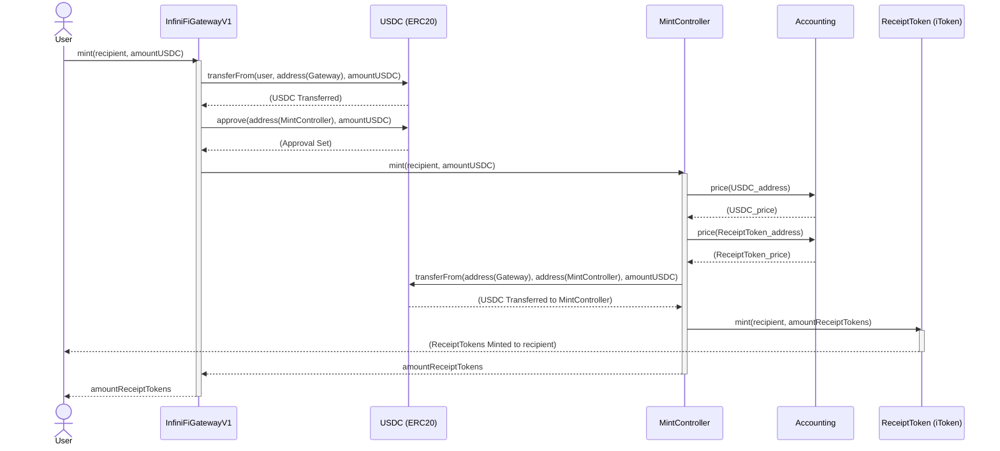
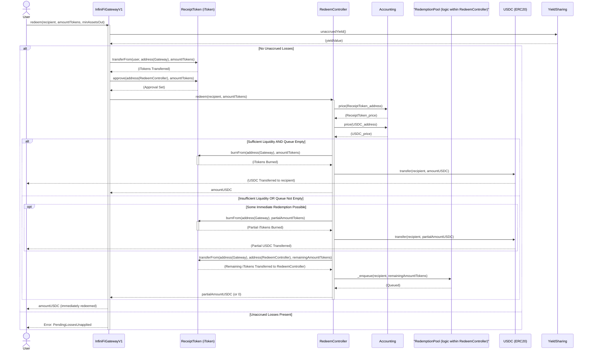
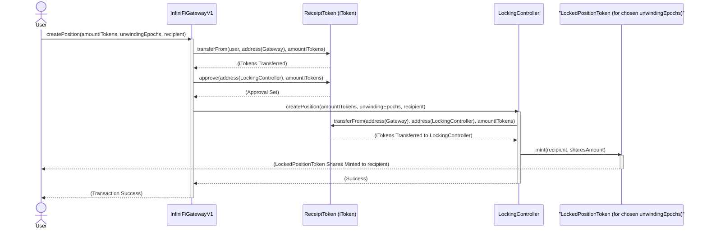
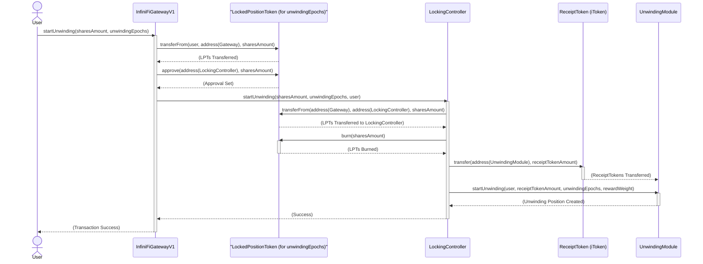
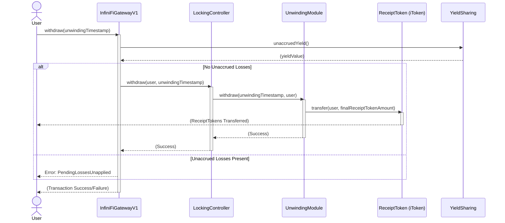
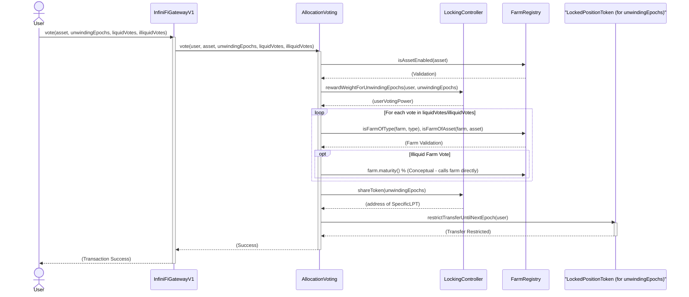

# InfiniFi Protocol Analysis

## Introduction

This document provides a comprehensive analysis of the InfiniFi protocol, a decentralized finance (DeFi) platform. The analysis is based on a review of its core smart contracts, covering various modules such as funding, locking, governance, finance, and system integrations. The InfiniFi protocol appears to enable users to deposit assets, receive yield-bearing tokens (iTokens), lock these tokens for enhanced yields and governance rights, and participate in directing asset allocation to different yield-generating farms. This document will detail the architecture, contract functionalities, key user flows, and a glossary of terms relevant to the protocol.

## Architectural Overview

This section describes the core architectural components of the InfiniFi protocol, focusing on access control, contract control mechanisms, and the main user gateway.

*(Content from `core_gateway_analysis.md`)*

### Contract Descriptions

#### 1. `InfiniFiCore.sol`

*   **Purpose:** This contract serves as the central access control and role management hub for the InfiniFi protocol. It defines and manages various roles and their administrative hierarchies.
*   **Functionality:**
    *   It inherits from OpenZeppelin's `AccessControlEnumerable` to provide a robust role-based access control (RBAC) system.
    *   Upon deployment, it grants the `GOVERNOR` role to the deployer (`msg.sender`).
    *   It initializes a set of predefined roles (e.g., `PAUSE`, `UNPAUSE`, `PROTOCOL_PARAMETERS`, `ENTRY_POINT`, `RECEIPT_TOKEN_MINTER`, etc.) and sets their admin role to `GOVERNOR`. This means the `GOVERNOR` has the authority to manage these roles.
    *   **`createRole(bytes32 role, bytes32 adminRole)`:** Allows the `GOVERNOR` to create new roles and assign an admin role to them. It prevents the creation of a role that already exists.
    *   **`setRoleAdmin(bytes32 role, bytes32 adminRole)`:** Allows the `GOVERNOR` to change the admin role of an existing role. It requires that the role already exists.
    *   **`grantRoles(bytes32[] calldata roles, address[] calldata accounts)`:** Allows an address with the appropriate admin privileges for a set of roles to grant those roles to multiple accounts in a batch. The caller must have the admin role for *each* role being granted.

#### 2. `CoreControlled.sol`

*   **Purpose:** This is an abstract contract designed to be inherited by other contracts within the InfiniFi protocol that need to be controlled or managed by `InfiniFiCore`. It provides common functionalities related to core contract interaction, pausable behavior, and emergency actions.
*   **Functionality:**
    *   It inherits from OpenZeppelin's `Pausable` contract, enabling deriving contracts to implement pause/unpause functionality.
    *   **`_core`:** Stores a reference to the `InfiniFiCore` contract.
    *   **`constructor(address coreAddress)`:** Initializes the contract with the address of the `InfiniFiCore` contract.
    *   **`onlyCoreRole(bytes32 role)`:** A modifier that restricts access to functions to only those callers who have the specified `role` granted in the `InfiniFiCore` contract.
    *   **`core()`:** Returns the address of the `InfiniFiCore` contract.
    *   **`setCore(address newCore)`:** Allows an account with the `GOVERNOR` role (from `InfiniFiCore`) to update the address of the `InfiniFiCore` contract. This is a critical function and can "brick" the contract if set incorrectly.
    *   **`pause()`:** Allows an account with the `PAUSE` role to pause the contract.
    *   **`unpause()`:** Allows an account with the `UNPAUSE` role to unpause the contract.
    *   **`emergencyAction(Call[] calldata calls)`:** A critical function callable only by the `GOVERNOR`. It allows the execution of arbitrary low-level calls (`target.call{value: value}(callData)`) to multiple target contracts. This is intended for emergency situations to perform corrective actions. The `Call` struct defines the target address, ETH value, and calldata for each action.

#### 3. `InfiniFiGatewayV1.sol`

*   **Purpose:** This contract acts as the main entry point for users to interact with the InfiniFi protocol's features. It orchestrates various operations like minting, staking, locking, redeeming, and voting by interacting with other specialized controller and token contracts.
*   **Functionality:**
    *   It inherits from `CoreControlled`, making its functions subject to role-based access control managed by `InfiniFiCore` and allowing it to be paused/unpaused.
    *   It also inherits from `ReentrancyGuardTransient` to protect against reentrancy attacks.
    *   **Address Registry:** Maintains a mapping (`addresses`) to store and retrieve addresses of other important protocol contracts (e.g., `USDC`, `mintController`, `stakedToken`, `receiptToken`, `lockingController`, `yieldSharing`, `allocationVoting`). These addresses are configurable by the `GOVERNOR`.
    *   **Zap Functionality:**
        *   Allows users to deposit various tokens (including ETH via `0xEeeeeEeeeEeEeeEeEeEeeEEEeeeeEeeeeeeeEEeE`) and convert them into protocol-specific tokens (e.g., receipt tokens, staked tokens, or locked positions) in a single transaction ("zap").
        *   Manages a whitelist of `enabledRouters` (e.g., DEX routers) that can be used for token swaps during zaps.
        *   A `zapFee` can be charged on zap operations, with the collected fees transferred to the `yieldSharing` contract.
        *   Functions: `zapIn`, `zapInAndStake`, `zapInAndLock`.
    *   **Minting:**
        *   `mint(address _to, uint256 _amount)`: Allows users to mint receipt tokens by providing USDC.
        *   `mintAndStake(address _to, uint256 _amount)`: Mints receipt tokens and stakes them in the `StakedToken` contract.
        *   `mintAndLock(address _to, uint256 _amount, uint32 _unwindingEpochs)`: Mints receipt tokens and locks them using the `LockingController`.
    *   **Locking & Unwinding:**
        *   `createPosition(uint256 _amount, uint32 _unwindingEpochs, address _recipient)`: Creates a new locked position.
        *   `startUnwinding(uint256 _shares, uint32 _unwindingEpochs)`: Initiates the unwinding process for a locked position.
        *   `increaseUnwindingEpochs(...)`, `cancelUnwinding(...)`: Manage existing unwinding processes.
        *   `withdraw(uint256 _unwindingTimestamp)`: Allows users to withdraw their assets after the unwinding period, but only if there are no unaccrued losses in the `YieldSharing` contract.
    *   **Redeeming:**
        *   `redeem(address _to, uint256 _amount, uint256 _minAssetsOut)`: Allows users to redeem their receipt tokens for underlying assets (e.g., USDC). Requires no unaccrued losses.
        *   `claimRedemption()`: Allows users to claim assets from a redemption process.
    *   **Voting:**
        *   `vote(...)`, `multiVote(...)`: Allows users to participate in allocation voting using their locked or staked assets, interacting with the `AllocationVoting` contract.
    *   **Configuration:**
        *   `setAddress(string memory _name, address _address)`: `GOVERNOR` can set addresses of dependent contracts.
        *   `setEnabledRouter(address _router, bool _enabled)`: `PROTOCOL_PARAMETERS` role can manage zap routers.
        *   `setZapFee(uint256 _zapFee)`: `PROTOCOL_PARAMETERS` role can set the zap fee.
    *   **Internal Checks:**
        *   `_revertIfThereAreUnaccruedLosses()`: An internal view function that checks the `YieldSharing` contract. If `unaccruedYield()` is negative (indicating pending losses), it reverts the transaction. This is used to protect the protocol during withdrawals and redemptions.

### Contract Interactions

1.  **`InfiniFiCore` as the Central Authority:**
    *   Both `CoreControlled` (and by extension, `InfiniFiGatewayV1`) rely on `InfiniFiCore` for role checking.
    *   `InfiniFiGatewayV1` uses the `onlyCoreRole` modifier (defined in `CoreControlled`) to restrict access to sensitive functions like `setAddress`, `setEnabledRouter`, `setZapFee`, `pause`, and `unpause`. These modifiers query `InfiniFiCore` to verify if `msg.sender` has the required role (e.g., `CoreRoles.GOVERNOR`, `CoreRoles.PROTOCOL_PARAMETERS`).
    *   The `InfiniFiCore` address itself can be updated in `CoreControlled` (and thus in `InfiniFiGatewayV1`) via the `setCore` function, which is restricted to the `GOVERNOR` role.

2.  **`CoreControlled` as a Base for Controlled Contracts:**
    *   `InfiniFiGatewayV1` inherits from `CoreControlled`. This inheritance provides:
        *   A direct reference (`_core`) to the `InfiniFiCore` contract.
        *   The `onlyCoreRole` modifier.
        *   Pausable functionality (`pause()`, `unpause()`), controlled by `PAUSE` and `UNPAUSE` roles defined in `InfiniFiCore`.
        *   The `emergencyAction` function, callable by the `GOVERNOR` role.

3.  **`InfiniFiGatewayV1` Orchestrating Protocol Functions:**
    *   **Address Dependencies:** `InfiniFiGatewayV1` heavily relies on its internal address registry (`addresses`) to interact with other crucial protocol components. These components are not directly detailed in the provided code but are referenced by their roles/names:
        *   `MintController`: For minting receipt tokens.
        *   `RedeemController`: For redeeming receipt tokens.
        *   `LockingController`: For managing locked positions.
        *   `StakedToken` (`siusd`): For staking receipt tokens.
        *   `ReceiptToken` (`iusd`): The primary token representing a user's deposit.
        *   `LockedPositionToken` (`liusd`): Represents shares in a locked position.
        *   `AllocationVoting`: For users to vote on asset allocations.
        *   `YieldSharing`: For managing yield distribution and tracking unaccrued yield/losses.
        *   `ERC20` (USDC): The primary stablecoin used for minting.
    *   **User Flow Example (Mint & Stake):**
        1.  User calls `mintAndStake` on `InfiniFiGatewayV1`.
        2.  `InfiniFiGatewayV1` transfers USDC from the user.
        3.  It approves the `MintController` to spend this USDC.
        4.  It calls `mint` on the `MintController`, which creates `ReceiptToken` (iusd).
        5.  `InfiniFiGatewayV1` then approves the `StakedToken` (siusd) contract to spend these iusd.
        6.  Finally, it calls `deposit` on the `StakedToken` contract to stake the iusd for the user.
    *   **Calls to `InfiniFiCore` (via `CoreControlled`):**
        *   When a user calls a restricted function on `InfiniFiGatewayV1` (e.g., an admin trying to `setAddress`), the `onlyCoreRole` modifier is triggered.
        *   This modifier calls `_core.hasRole(role, msg.sender)` (where `_core` is `InfiniFiCore`) to check permissions.

### Mermaid Diagram

```mermaid
graph TD
    subgraph "Access Control"
        InfiniFiCore["InfiniFiCore (AccessControlEnumerable)"]
    end

    subgraph "Controlled Contracts"
        CoreControlled["CoreControlled (Pausable)"]
        InfiniFiGatewayV1["InfiniFiGatewayV1 (ReentrancyGuardTransient)"]
    end

    subgraph "External Protocol Components (Referenced by InfiniFiGatewayV1)"
        MintController["MintController"]
        RedeemController["RedeemController"]
        LockingController["LockingController"]
        StakedToken["StakedToken (siUSD)"]
        ReceiptToken["ReceiptToken (iUSD)"]
        LockedPositionToken["LockedPositionToken (liUSD)"]
        AllocationVoting["AllocationVoting"]
        YieldSharing["YieldSharing"]
        USDC["USDC (ERC20)"]
        DEXRouter["DEX Router(s)"]
    end

    %% Inheritance
    CoreControlled --|> Pausable_OZ[Pausable @openzeppelin]
    InfiniFiCore --|> AccessControlEnumerable_OZ[AccessControlEnumerable @openzeppelin]
    InfiniFiGatewayV1 --|> CoreControlled
    InfiniFiGatewayV1 --|> ReentrancyGuardTransient_OZ[ReentrancyGuardTransient @openzeppelin]

    %% Interactions: InfiniFiGatewayV1 uses CoreControlled
    InfiniFiGatewayV1 -->|references| CoreControlled_Util["CoreControlled Utilities (modifier, core(), setCore(), pause(), emergencyAction())"]
    CoreControlled_Util --> InfiniFiCore_Instance["InfiniFiCore Instance (_core)"]

    %% Interactions: CoreControlled uses InfiniFiCore
    CoreControlled_Util --"calls for role checks (hasRole)"--> InfiniFiCore
    CoreControlled_Util --"calls to update core (setCore)"--> InfiniFiCore_Instance

    %% Interactions: InfiniFiGatewayV1 calls other protocol components
    InfiniFiGatewayV1 --"calls mint()"--> MintController
    InfiniFiGatewayV1 --"calls redeem()"--> RedeemController
    InfiniFiGatewayV1 --"calls createPosition(), startUnwinding(), etc."--> LockingController
    InfiniFiGatewayV1 --"calls deposit(), redeem()"--> StakedToken
    InfiniFiGatewayV1 --"calls transferFrom(), approve()"--> ReceiptToken
    InfiniFiGatewayV1 --"calls transferFrom(), approve()"--> LockedPositionToken
    InfiniFiGatewayV1 --"calls vote(), multiVote()"--> AllocationVoting
    InfiniFiGatewayV1 --"transfers zap fees, checks unaccruedYield()"--> YieldSharing
    InfiniFiGatewayV1 --"transfers from user, approves"--> USDC
    InfiniFiGatewayV1 --"calls for token swaps (zap)"--> DEXRouter

    %% Role Management by InfiniFiCore
    InfiniFiCore --"manages roles for"--> InfiniFiGatewayV1_AdminFuncs["Admin Functions in InfiniFiGatewayV1 (setAddress, setZapFee, etc.)"]
    InfiniFiCore --"manages GOVERNOR, PAUSE, UNPAUSE roles for"--> CoreControlled

    classDef ozContract fill:#DCDCDC,stroke:#333,stroke-width:2px,color:#000
    class Pausable_OZ,AccessControlEnumerable_OZ,ReentrancyGuardTransient_OZ ozContract
```

## Smart Contract Breakdown

This section delves into the specific modules of the InfiniFi protocol.

### Funding Module

*(Content from `funding_module_analysis.md`)*

This module handles the minting of `ReceiptToken`s against deposited assets and the redemption of `ReceiptToken`s back to the underlying assets.

#### Contract Descriptions

##### 1. `ReceiptToken.sol`

*   **Purpose:** This contract defines the `ReceiptToken` (e.g., iUSD), which represents a user's share or deposit in the InfiniFi protocol. It is an ERC20 token with additional functionalities for minting, burning, and permit (gas-less approvals).
*   **Functionality:**
    *   Inherits from `CoreControlled`, `ERC20Permit`, and `ERC20Burnable`.
    *   **`CoreControlled`:** Its administrative functions (like `mint` and `burn`) are restricted by roles defined in `InfiniFiCore`.
    *   **`ERC20Permit`:** Allows users to approve token spending via an off-chain signature, rather than an on-chain transaction.
    *   **`ERC20Burnable`:** Provides standard `burn` and `burnFrom` functions.
    *   **`constructor(address _core, string memory _name, string memory _symbol)`:** Initializes the token with a reference to `InfiniFiCore`, its name, and symbol.
    *   **`mint(address _to, uint256 _amount)`:** Mints new receipt tokens to a specified address. This function can only be called by an address holding the `CoreRoles.RECEIPT_TOKEN_MINTER` role (typically the `MintController`).
    *   **`burn(uint256 _value)`:** Burns receipt tokens from the caller's balance. This function can only be called by an address holding the `CoreRoles.RECEIPT_TOKEN_BURNER` role (typically the `RedeemController`).
    *   **`burnFrom(address _account, uint256 _value)`:** Burns receipt tokens from a specified account's balance, provided the caller has sufficient allowance. Also restricted to the `CoreRoles.RECEIPT_TOKEN_BURNER` role.

##### 2. `MintController.sol`

*   **Purpose:** This contract manages the process of creating (minting) new `ReceiptToken`s in exchange for an underlying asset (e.g., USDC). It acts as an entry point for new funds into the protocol and is designed to report its assets like a `Farm` for standardized accounting.
*   **Functionality:**
    *   Inherits from `Farm` and implements `IMintController`. `Farm` itself inherits from `CoreControlled`.
    *   **State Variables:**
        *   `receiptToken`: Address of the `ReceiptToken` contract.
        *   `accounting`: Address of the `Accounting` contract (used for price feeds).
        *   `minAssetAmount`: Minimum amount of asset required for minting.
        *   `afterMintHook`: Optional address of a contract to call after a successful mint operation.
    *   **`constructor(address _core, address _assetToken, address _receiptToken, address _accounting)`:** Initializes with core, asset token (e.g., USDC), receipt token, and accounting contract addresses.
    *   **`assetToReceipt(uint256 _assetAmount)`:** Calculates the amount of `ReceiptToken`s a user will receive for a given amount of `assetToken`. It uses prices from the `Accounting` contract.
    *   **`mint(address _to, uint256 _assetAmountIn)`:**
        *   Restricted to callers with the `CoreRoles.ENTRY_POINT` role (typically `InfiniFiGatewayV1`).
        *   Requires `_assetAmountIn` to be above `minAssetAmount`.
        *   Calculates `receiptAmountOut` using `assetToReceipt`.
        *   Transfers `_assetAmountIn` of `assetToken` from the `msg.sender` (the Gateway) to itself.
        *   Calls `mint` on the `ReceiptToken` contract to create `receiptAmountOut` tokens for the user (`_to`).
        *   Optionally calls an `afterMint` function on the `afterMintHook` contract.
    *   **`assets()` & `liquidity()`:** Returns the balance of `assetToken` held by the controller.
    *   **Farm Overrides (`_deposit`, `deposit`, `_withdraw`, `withdraw`):** Implements `Farm`'s deposit/withdraw logic. Deposits are no-ops internally as funds come via `mint`. Withdrawals transfer `assetToken` and are restricted to `CoreRoles.FARM_MANAGER`.

##### 3. `RedemptionPool.sol`

*   **Purpose:** This is an abstract contract that provides the core logic for managing a redemption queue. It handles the queuing of redemption requests when immediate fulfillment is not possible and the processing of these requests as funds become available. It does *not* handle token transfers itself; this is left to the inheriting contract.
*   **Functionality:**
    *   Uses `RedemptionQueue` library for queue management.
    *   **State Variables:**
        *   `queue`: The actual queue of `RedemptionRequest` structs (amount, recipient).
        *   `MAX_QUEUE_LENGTH`: Maximum number of requests in the queue.
        *   `userPendingClaims`: Mapping from recipient address to the amount of asset they can claim.
        *   `totalPendingClaims`: Total amount of asset (e.g., USDC) currently available for claiming.
        *   `totalEnqueuedRedemptions`: Total amount of `ReceiptToken` (e.g., iUSD) currently waiting in the queue.
    *   **`_fundRedemptionQueue(uint256 _assetAmount, uint256 _convertReceiptToAssetRatio)`:**
        *   Internal function called when new assets are available to process queued redemptions.
        *   Iterates through the `queue`, funding requests as much as possible with `_assetAmount`.
        *   If a request is fully funded, it's popped from the queue. If partially funded, its amount is updated.
        *   Updates `userPendingClaims` for recipients whose requests are funded.
        *   Updates `totalPendingClaims` and `totalEnqueuedRedemptions`.
        *   Returns the remaining `_assetAmount` (if any) and the total amount of `ReceiptToken` that corresponds to the funded asset amount (this is the amount to be burned by the caller).
    *   **`_claimRedemption(address _recipient)`:**
        *   Internal function to process a user's claim.
        *   Checks `userPendingClaims` for the recipient.
        *   Resets the user's pending claim to zero and decreases `totalPendingClaims`.
        *   Returns the amount claimed.
    *   **`_enqueue(address _recipient, uint256 _amount)`:**
        *   Internal function to add a new redemption request to the `queue`.
        *   Checks against `MAX_QUEUE_LENGTH`.
        *   Increases `totalEnqueuedRedemptions`.

##### 4. `RedeemController.sol`

*   **Purpose:** This contract manages the process of redeeming `ReceiptToken`s for the underlying asset. It handles both immediate redemptions (if enough liquidity is available) and queued redemptions (if liquidity is insufficient, using `RedemptionPool` logic). It also acts as a `Farm` for accounting purposes.
*   **Functionality:**
    *   Inherits from `Farm`, `RedemptionPool`, and implements `IRedeemController`.
    *   **State Variables:**
        *   `receiptToken`: Address of the `ReceiptToken` contract.
        *   `accounting`: Address of the `Accounting` contract.
        *   `minRedemptionAmount`: Minimum amount of `ReceiptToken` for redemption.
        *   `beforeRedeemHook`: Optional address of a contract to call before a redeem operation.
    *   **`constructor(...)`:** Similar to `MintController`.
    *   **`receiptToAsset(uint256 _receiptAmount)`:** Calculates the amount of `assetToken` a user will receive for a given amount of `ReceiptToken`, using prices from `Accounting`.
    *   **`redeem(address _to, uint256 _receiptAmountIn)`:**
        *   Restricted to `CoreRoles.ENTRY_POINT` (typically `InfiniFiGatewayV1`).
        *   Calculates `assetAmountOut` using `_getReceiptToAssetConvertRatio`.
        *   **Queue Logic:** If `queueLength() > 0` (from `RedemptionPool`), it transfers `_receiptAmountIn` from `msg.sender` (Gateway) to itself and calls `_enqueue` to add the request to the queue. Returns 0 assets immediately.
        *   **Immediate/Partial Redemption:**
            *   If `assetAmountOut` is less than or equal to `liquidity()` (assets held by the controller minus `totalPendingClaims`):
                *   Burns `_receiptAmountIn` of `ReceiptToken` from `msg.sender` (Gateway).
                *   Transfers `assetAmountOut` of `assetToken` to the user (`_to`).
                *   Returns `assetAmountOut`.
            *   If `assetAmountOut` is greater than `liquidity()`:
                *   Burns an amount of `ReceiptToken` from `msg.sender` (Gateway) corresponding to the `availableAssetAmount`.
                *   Transfers `availableAssetAmount` of `assetToken` to the user (`_to`).
                *   Transfers the remaining `ReceiptToken` (for the unfunded portion) from `msg.sender` (Gateway) to itself.
                *   Calls `_enqueue` to add the remaining amount to the redemption queue.
                *   Returns `availableAssetAmount`.
    *   **`claimRedemption(address _recipient)`:**
        *   Restricted to `CoreRoles.ENTRY_POINT`.
        *   Calls `_claimRedemption` (from `RedemptionPool`) to get the claimable asset amount.
        *   Transfers this amount of `assetToken` to the `_recipient`.
    *   **`_deposit(uint256 assetsToDeposit)` (Farm override):**
        *   When assets are deposited into the `RedeemController` (e.g., by a `FARM_MANAGER`), it calls `_fundRedemptionQueue` to process pending redemptions.
        *   If `_fundRedemptionQueue` indicates that `ReceiptToken`s were effectively redeemed (because their corresponding assets were funded), this function calls `burn` on the `ReceiptToken` contract to remove those tokens from circulation.
    *   **Internal Helpers:** `_getReceiptToAssetConvertRatio`, `_convertReceiptToAsset`, `_convertAssetToReceipt` for price conversions.

#### Contract Interactions & Funding Flow

##### Minting Process:

1.  **User Interaction (via Gateway):** A user intends to mint `ReceiptToken`s. They interact with a function on `InfiniFiGatewayV1` (e.g., `mint()`, `mintAndStake()`).
2.  **Gateway to MintController:** `InfiniFiGatewayV1` (having `CoreRoles.ENTRY_POINT`) calls `MintController.mint(userAddress, assetAmount)`. Before this, the Gateway would have received `assetAmount` of `assetToken` (e.g., USDC) from the user.
3.  **Asset Transfer:** `MintController` transfers `assetAmount` of `assetToken` from `InfiniFiGatewayV1` to itself.
4.  **Price Calculation:** `MintController` calls `Accounting.price()` for both `assetToken` and `receiptToken` to determine the conversion ratio and calculate the amount of `ReceiptToken`s to be minted (`receiptAmountOut`).
5.  **ReceiptToken Minting:** `MintController` (having `CoreRoles.RECEIPT_TOKEN_MINTER` implicitly through its design or explicit grant) calls `ReceiptToken.mint(userAddress, receiptAmountOut)`.
6.  **Token Issuance:** `ReceiptToken` mints the new tokens and assigns them to the `userAddress`.
7.  **(Optional) Hook:** `MintController` may call an `afterMintHook`.

##### Redemption Process:

1.  **User Interaction (via Gateway):** A user intends to redeem `ReceiptToken`s for the underlying asset. They interact with a function on `InfiniFiGatewayV1` (e.g., `redeem()`).
2.  **Gateway to RedeemController:** `InfiniFiGatewayV1` (having `CoreRoles.ENTRY_POINT`) calls `RedeemController.redeem(userAddress, receiptAmountIn)`. Before this, the Gateway would have received/approved `receiptAmountIn` of `ReceiptToken` from the user.
3.  **Price Calculation:** `RedeemController` calls `Accounting.price()` for both `assetToken` and `receiptToken` to determine the `assetAmountOut`.
4.  **Liquidity Check & Action:**
    *   **Queue Active:** If `RedeemController.queueLength() > 0`, `RedeemController` transfers `receiptAmountIn` of `ReceiptToken` from the Gateway to itself and calls `_enqueue` (from `RedemptionPool`) to add the request to the queue. The user receives 0 assets immediately.
    *   **Sufficient Liquidity:** If the queue is empty and `RedeemController` has enough `assetToken` to cover `assetAmountOut`:
        *   `RedeemController` (having `CoreRoles.RECEIPT_TOKEN_BURNER`) calls `ReceiptToken.burnFrom(gatewayAddress, receiptAmountIn)` (or `burn` if tokens were transferred first).
        *   `ReceiptToken` burns the specified tokens.
        *   `RedeemController` transfers `assetAmountOut` of `assetToken` to `userAddress`.
    *   **Insufficient Liquidity:** If the queue is empty but `RedeemController` has some, but not enough, `assetToken`:
        *   The available portion is processed immediately: `ReceiptToken`s corresponding to available assets are burned, and available assets are sent to the user.
        *   The remaining unfunded portion: `RedeemController` transfers the corresponding remaining `ReceiptToken`s from the Gateway to itself and calls `_enqueue` to queue the remainder.
5.  **Funding the Queue (via `RedeemController._deposit`):**
    *   When assets are deposited into `RedeemController` (e.g., by a `FARM_MANAGER` calling `deposit()`), `_deposit` is triggered.
    *   `_deposit` calls `_fundRedemptionQueue` (from `RedemptionPool`) with the deposited asset amount and the current conversion ratio.
    *   `_fundRedemptionQueue` processes queued requests, updating `userPendingClaims` and `totalPendingClaims`. It returns the amount of `ReceiptToken` that now corresponds to newly funded assets (`receiptAmountToBurn`).
    *   `RedeemController` then calls `ReceiptToken.burn(receiptAmountToBurn)` to burn these `ReceiptToken`s which are now effectively backed by the deposited assets and claimable by users.
6.  **Claiming Redemption (User via Gateway):**
    *   User calls `claimRedemption()` on `InfiniFiGatewayV1`.
    *   Gateway calls `RedeemController.claimRedemption(userAddress)`.
    *   `RedeemController` calls `_claimRedemption` (from `RedemptionPool`) to get the amount of `assetToken` owed to the user from `userPendingClaims`.
    *   `RedeemController` transfers this amount of `assetToken` to `userAddress`.

#### Mermaid Diagram

```mermaid
graph LR
    subgraph "User Interaction"
        User["User"]
    end

    subgraph "Core Protocol Layer"
        Gateway["InfiniFiGatewayV1"]
    end

    subgraph "Funding Module"
        MintController["MintController (Farm)"]
        RedeemController["RedeemController (Farm, RedemptionPool)"]
        ReceiptToken["ReceiptToken (ERC20, CoreControlled)"]
        RedemptionPool["RedemptionPool (Abstract)"]
    end

    subgraph "Supporting Services"
        Accounting["Accounting"]
        InfiniFiCore["InfiniFiCore"]
    end

    subgraph "Assets"
        AssetToken["Asset Token (e.g., USDC)"]
    end

    %% Inheritance
    MintController --|> Farm_MC[Farm]
    RedeemController --|> Farm_RC[Farm]
    RedeemController --|> RedemptionPool
    ReceiptToken --|> CoreControlled_RT[CoreControlled]
    Farm_MC --|> CoreControlled_FMC[CoreControlled]
    Farm_RC --|> CoreControlled_FRC[CoreControlled]


    %% Minting Flow
    User -- "1. Initiate Mint (e.g., USDC)" --> Gateway
    Gateway -- "2. Calls mint(user, assetAmt)" --> MintController
    MintController -- "3. Transfers AssetToken from Gateway" --> AssetToken
    MintController -- "4. Gets prices" --> Accounting
    MintController -- "5. Calls mint(user, receiptAmt)" --> ReceiptToken
    ReceiptToken -- "6. Mints to User" --> User

    %% Redemption Flow (Immediate / Partial + Queue)
    User -- "1. Initiate Redeem (ReceiptTokens)" --> Gateway
    Gateway -- "2. Calls redeem(user, receiptAmt)" --> RedeemController
    RedeemController -- "3. Gets prices" --> Accounting
    RedeemController -- "4a. IF Queue Active OR Insufficient Liquidity (for part)" -->|Transfers ReceiptToken to self & _enqueue| RedemptionPool
    RedeemController -- "4b. IF Sufficient Liquidity (for all/part)" -->|Calls burnFrom(gateway, receiptAmt) / burn()| ReceiptToken
    ReceiptToken -- "4b. Burns Tokens" -->|Updates Supply| ReceiptToken
    RedeemController -- "4b. Transfers AssetToken to User" --> AssetToken
    AssetToken -- "Funds User" --> User


    %% Queue Funding & Claiming
    subgraph "Farm Manager Interaction (Queue Funding)"
      FarmManager["Farm Manager"]
      FarmManager -- "Deposits Assets" --> RedeemController
    end
    RedeemController -- "_deposit() calls _fundRedemptionQueue()" --> RedemptionPool
    RedemptionPool -- "_fundRedemptionQueue updates claims & returns amount to burn" --> RedeemController
    RedeemController -- "Calls burn() on ReceiptToken" --> ReceiptToken

    User -- "Claim Queued Redemption" --> Gateway
    Gateway -- "Calls claimRedemption(user)" --> RedeemController
    RedeemController -- "_claimRedemption() from RedemptionPool" --> RedemptionPool
    RedemptionPool -- "Returns claimable assets" --> RedeemController
    RedeemController -- "Transfers AssetToken to User" --> AssetToken


    %% Role Control
    MintController -- "onlyCoreRole (ENTRY_POINT for mint)" --> InfiniFiCore
    RedeemController -- "onlyCoreRole (ENTRY_POINT for redeem/claim)" --> InfiniFiCore
    ReceiptToken -- "onlyCoreRole (MINTER/BURNER)" --> InfiniFiCore
    MintController -- "onlyCoreRole (FARM_MANAGER for withdraw)" --> InfiniFiCore
    RedeemController -- "onlyCoreRole (FARM_MANAGER for withdraw/deposit)" --> InfiniFiCore

    classDef abstract fill:#E6E6FA,stroke:#333,stroke-width:2px,color:#000
    class RedemptionPool abstract
```

### Locking Module

*(Content from `locking_module_analysis.md`)*

This module allows users to lock their `ReceiptToken`s for specified durations to earn enhanced yields and gain voting power.

#### Contract Descriptions

##### 1. `LockedPositionToken.sol`

*   **Purpose:** This contract defines an ERC20 token that represents a user's locked position for a *specific* unwinding duration (bucket). For each defined unwinding period (e.g., 2 weeks, 4 weeks), a distinct `LockedPositionToken` contract would be deployed. These tokens are also known as "share tokens" within the `LockingController`.
*   **Functionality:**
    *   Inherits from `CoreControlled`, `ERC20Permit`, and `ERC20Burnable`.
    *   **`CoreControlled`:** Its administrative functions (minting, burning) are restricted by `InfiniFiCore` roles.
    *   **`ERC20Permit` & `ERC20Burnable`:** Standard ERC20 extensions.
    *   **`constructor(address _core, string memory _name, string memory _symbol)`:** Initializes the token.
    *   **`mint(address _to, uint256 _amount)`:** Mints new locked position tokens. Only callable by an address with the `CoreRoles.LOCKED_TOKEN_MANAGER` role (which is the `LockingController`).
    *   **`burn(uint256 _value)` & `burnFrom(address _account, uint256 _value)`:** Burns tokens. Also restricted to `CoreRoles.LOCKED_TOKEN_MANAGER`.
    *   **Transfer Restrictions:**
        *   `transferRestrictions`: A mapping to store timestamps until which a user's tokens are restricted from being transferred.
        *   `restrictTransferUntilNextEpoch(address _user)`: Allows an address with `CoreRoles.TRANSFER_RESTRICTOR` to prevent a user from transferring their locked position tokens until the start of the next epoch.
        *   `_update(address _from, address _to, uint256 _value)`: Overrides the internal ERC20 transfer function to enforce these transfer restrictions.

##### 2. `UnwindingModule.sol`

*   **Purpose:** This contract manages the lifecycle of locked positions that are currently in the "unwinding" phase. When a user decides to unlock their position, the corresponding receipt tokens are moved from the `LockingController` to this module. It handles the gradual release of these tokens over the specified unwinding period and manages the distribution of rewards or application of losses to these unwinding positions.
*   **Functionality:**
    *   Inherits from `CoreControlled`.
    *   **State Variables:**
        *   `receiptToken`: The address of the underlying token being locked (e.g., iUSD).
        *   `totalShares`, `totalReceiptTokens`: Tracks the total amount of tokens (in shares and receipt token value) within the module.
        *   `slashIndex`: A factor (starts at 1e18) that is reduced when losses are applied, affecting the value of all unwinding positions.
        *   `positions`: Mapping from a unique ID (user address + start timestamp) to an `UnwindingPosition` struct.
            *   `UnwindingPosition`: Contains shares, start/end epochs for unwinding, and reward weight parameters.
        *   `globalPoints`, `lastGlobalPointEpoch`: Manages a series of "global points" in time (epochs) to track changes in total reward weight and distributed rewards, allowing for fair reward calculation for positions that start/end unwinding at different times.
        *   `rewardWeightBiasIncreases`, `rewardWeightIncreases`, `rewardWeightDecreases`: Mappings to track changes to reward weights across epochs.
    *   **Core Logic - Unwinding Positions:**
        *   `startUnwinding(address _user, uint256 _receiptTokens, uint32 _unwindingEpochs, uint256 _rewardWeight)`:
            *   Called by `LockingController` (which has `CoreRoles.LOCKED_TOKEN_MANAGER`).
            *   Creates a new `UnwindingPosition` for the user.
            *   Calculates reward weight decrease per epoch.
            *   Updates total shares/receipt tokens and global reward weight tracking variables.
        *   `cancelUnwinding(address _user, uint256 _startUnwindingTimestamp, uint32 _newUnwindingEpochs)`:
            *   Called by `LockingController` (acting as `LOCKED_TOKEN_MANAGER` for this call).
            *   Allows a user to stop an ongoing unwinding process.
            *   Calculates the current value of the unwinding position (including earned rewards).
            *   Removes the position from this module.
            *   Approves `LockingController` to pull back the receipt tokens, and `LockingController` then calls its `createPosition` function to re-lock the tokens for the `_newUnwindingEpochs`.
        *   `withdraw(uint256 _startUnwindingTimestamp, address _owner)`:
            *   Called by `LockingController`.
            *   Allows a user to withdraw their receipt tokens after the unwinding period (`position.toEpoch`) has passed.
            *   Calculates the final share amount (including rewards).
            *   Deletes the position and updates global state.
            *   Transfers the final amount of `receiptToken` to the owner.
    *   **Rewards and Losses:**
        *   `depositRewards(uint256 _amount)`: Called by `LockingController` to distribute rewards to unwinding positions. Rewards are converted to shares and added to `totalShares` and `point.rewardShares`.
        *   `applyLosses(uint256 _amount)`: Called by `LockingController`. Reduces `totalReceiptTokens` and updates `slashIndex`. This proportionally reduces the value of all unwinding positions.
    *   **Read Functions:**
        *   `balanceOf(address _user, uint256 _startUnwindingTimestamp)`: Calculates the current claimable amount of `receiptToken` for a user's specific unwinding position, including accrued rewards and applied losses.
        *   `rewardWeight(address _user, uint256 _startUnwindingTimestamp)`: Calculates the current reward weight of an unwinding position.
        *   `totalRewardWeight()`: Returns the aggregate reward weight of all positions in the module.

##### 3. `LockingController.sol`

*   **Purpose:** This is the main orchestrator for the locking mechanism. It allows users to lock their `receiptToken`s for predefined periods ("buckets" or "unwinding epochs"), manages these locked positions through distinct `LockedPositionToken`s for each bucket, and handles the distribution of rewards or application of losses to these locked (not yet unwinding) positions. It interacts with the `UnwindingModule` when users decide to start or cancel unwinding.
*   **Functionality:**
    *   Inherits from `CoreControlled`.
    *   **State Variables:**
        *   `receiptToken`: The address of the token being locked (e.g., iUSD).
        *   `unwindingModule`: Address of the `UnwindingModule` contract.
        *   `enabledBuckets`: An array of `uint32` representing the allowed unwinding durations in epochs (e.g., [2, 4, 6] weeks).
        *   `buckets`: Mapping from `unwindingEpochs` (duration) to `BucketData`.
            *   `BucketData`: Struct containing the address of the specific `LockedPositionToken` for that bucket, the total `receiptToken`s locked in that bucket, and a `multiplier` for reward weight calculation.
        *   `globalReceiptToken`: Total `receiptToken`s locked across all buckets (not in unwinding).
        *   `globalRewardWeight`: Aggregate reward weight for all locked (not unwinding) positions.
        *   `maxLossPercentage`: A cap on how much loss can be applied in a single `applyLosses` call before the contract pauses.
    *   **Administration:**
        *   `enableBucket(uint32 _unwindingEpochs, address _shareToken, uint256 _multiplier)`: `GOVERNOR` can enable new lock durations, providing the address of a deployed `LockedPositionToken` for it and a reward multiplier.
        *   `setBucketMultiplier(...)`: `PROTOCOL_PARAMETERS` can update a bucket's multiplier.
        *   `setMaxLossPercentage(...)`: `GOVERNOR` can set the loss cap.
    *   **Position Management:**
        *   `createPosition(uint256 _amount, uint32 _unwindingEpochs, address _recipient)`:
            *   Typically called by `InfiniFiGatewayV1` (via `CoreRoles.ENTRY_POINT`). Can also be re-entered by `UnwindingModule` during `cancelUnwinding`.
            *   User transfers `_amount` of `receiptToken` to this contract.
            *   Calculates the number of `LockedPositionToken` shares to mint based on the current exchange rate for that bucket.
            *   Mints these shares (specific `LockedPositionToken` for `_unwindingEpochs`) to the `_recipient`.
            *   Updates `bucket.totalReceiptTokens`, `globalReceiptToken`, and `globalRewardWeight`.
        *   `startUnwinding(uint256 _shares, uint32 _unwindingEpochs, address _recipient)`:
            *   Called by `InfiniFiGatewayV1`.
            *   User transfers their `LockedPositionToken` shares (for `_unwindingEpochs`) to this contract.
            *   These shares are burned.
            *   Calculates the corresponding `receiptToken` amount.
            *   Transfers these `receiptToken`s to the `UnwindingModule`.
            *   Calls `UnwindingModule.startUnwinding(...)` to initiate the unwinding process there.
            *   Updates its own global and bucket-specific token/reward weight counts.
        *   `increaseUnwindingEpochs(...)`: Allows a user to move their locked position from a shorter duration bucket to a longer one. Burns shares from the old bucket's `LockedPositionToken` and mints shares in the new one.
        *   `cancelUnwinding(...)`: Relays the call to `UnwindingModule.cancelUnwinding(...)`.
        *   `withdraw(...)`: Relays the call to `UnwindingModule.withdraw(...)`.
    *   **Rewards and Losses:**
        *   `depositRewards(uint256 _amount)`: `FINANCE_MANAGER` deposits rewards.
            *   Splits rewards between locked positions (managed here) and unwinding positions (transfers a portion to `UnwindingModule.depositRewards`).
            *   For locked positions, increases `bucket.totalReceiptTokens` for each bucket proportionally to its reward weight, effectively increasing the value of each `LockedPositionToken` share in that bucket. Updates global/bucket reward weights.
        *   `applyLosses(uint256 _amount)`: `FINANCE_MANAGER` applies losses.
            *   If losses exceed `maxLossPercentage` of `totalBalance()`, it fully slashes all tokens and pauses the contract.
            *   Splits losses between locked and unwinding positions (calls `UnwindingModule.applyLosses`).
            *   For locked positions, burns `receiptToken` from its own balance and decreases `bucket.totalReceiptTokens` proportionally, reducing share values. Updates global/bucket reward weights.
    *   **Read Functions:** `balanceOf(address _user)`, `rewardWeight(address _user)`, `exchangeRate(uint32 _unwindingEpochs)`, `totalBalance()`, `rewardMultiplier()`.

#### Contract Interactions & Locking/Unwinding Flow

##### 1. Creating a Locked Position:

1.  **User (via Gateway):** User wants to lock `X` amount of `ReceiptToken` for `N` unwinding epochs. They call a function on `InfiniFiGatewayV1`.
2.  **Gateway to LockingController:** `InfiniFiGatewayV1` calls `LockingController.createPosition(X, N, userAddress)`.
3.  **ReceiptToken Transfer:** `LockingController` pulls `X` `ReceiptToken`s from the Gateway (which would have received them from the user).
4.  **Share Calculation:** `LockingController` determines the target bucket based on `N`. It calculates how many shares of that bucket's specific `LockedPositionToken` to mint for `X` `ReceiptToken`s (based on `buckets[N].totalReceiptTokens` and `LockedPositionToken[N].totalSupply()`).
5.  **LockedPositionToken Minting:** `LockingController` calls `mint(userAddress, shareAmount)` on the specific `LockedPositionToken` for bucket `N`.
6.  **State Update:** `LockingController` updates `buckets[N].totalReceiptTokens`, `globalReceiptToken`, and `globalRewardWeight`.

##### 2. Starting the Unwinding Process:

1.  **User (via Gateway):** User wants to start unwinding their position in bucket `N`, for which they hold `S` shares of `LockedPositionToken[N]`. They call a function on `InfiniFiGatewayV1`.
2.  **Gateway to LockingController:** `InfiniFiGatewayV1` calls `LockingController.startUnwinding(S, N, userAddress)`.
3.  **LockedPositionToken Transfer & Burn:** `LockingController` pulls `S` shares of `LockedPositionToken[N]` from the Gateway. It then calls `burn(S)` on `LockedPositionToken[N]`.
4.  **ReceiptToken Calculation:** `LockingController` calculates the amount of `ReceiptToken` corresponding to `S` shares.
5.  **Transfer to UnwindingModule:** `LockingController` transfers this calculated `ReceiptToken` amount to the `UnwindingModule`.
6.  **Initiate Unwinding in Module:** `LockingController` calls `UnwindingModule.startUnwinding(userAddress, receiptTokenAmount, N, rewardWeight)`.
7.  **State Update (LockingController):** `LockingController` reduces its `buckets[N].totalReceiptTokens`, `globalReceiptToken`, and `globalRewardWeight`.
8.  **State Update (UnwindingModule):** `UnwindingModule` creates an `UnwindingPosition` for the user, updates its internal `totalShares`, `totalReceiptTokens`, and global reward point data.

##### 3. Cancelling Unwinding:

1.  **User (via Gateway):** User is unwinding (position identified by `startTimestamp`) and wants to cancel and re-lock for `M` new unwinding epochs. They call `InfiniFiGatewayV1`.
2.  **Gateway to LockingController:** `InfiniFiGatewayV1` calls `LockingController.cancelUnwinding(userAddress, startTimestamp, M)`.
3.  **LockingController to UnwindingModule:** `LockingController` calls `UnwindingModule.cancelUnwinding(userAddress, startTimestamp, M)`.
4.  **UnwindingModule Logic:**
    *   Calculates the current value (receipt tokens, including rewards/losses) of the user's unwinding position.
    *   Deletes the `UnwindingPosition`. Updates its internal totals and global reward points.
    *   Approves `LockingController` to spend the calculated `ReceiptToken` amount.
    *   Calls `LockingController.createPosition(calculatedReceiptAmount, M, userAddress)` (re-entrancy).
5.  **LockingController (createPosition re-entry):** The standard `createPosition` logic is followed (as in Flow 1), effectively re-locking the tokens.

##### 4. Withdrawing After Unwinding:

1.  **User (via Gateway):** User's unwinding period (identified by `startTimestamp`) has completed. They call `InfiniFiGatewayV1`.
2.  **Gateway to LockingController:** `InfiniFiGatewayV1` calls `LockingController.withdraw(userAddress, startTimestamp)`.
3.  **LockingController to UnwindingModule:** `LockingController` calls `UnwindingModule.withdraw(startTimestamp, userAddress)`.
4.  **UnwindingModule Logic:**
    *   Verifies the unwinding period is complete.
    *   Calculates the final `ReceiptToken` amount for the user (including all rewards/losses during unwinding).
    *   Deletes the `UnwindingPosition`. Updates its internal totals and global reward points.
    *   Transfers the final `ReceiptToken` amount directly to `userAddress`.

##### 5. Rewards & Losses Distribution:

*   **Rewards:**
    1.  `FinanceManager` calls `LockingController.depositRewards(totalRewardAmount)`.
    2.  `LockingController` splits `totalRewardAmount`:
        *   A portion is sent to `UnwindingModule.depositRewards(unwindingRewardAmount)`.
            *   `UnwindingModule` converts `unwindingRewardAmount` to shares and adds to its `totalShares` and current `globalPoint.rewardShares`. This benefits all current unwinding positions.
        *   The remaining portion is kept by `LockingController`.
            *   `LockingController` distributes this among its active buckets by increasing each `bucket.totalReceiptTokens` proportionally to its reward weight. This increases the `ReceiptToken` value per share of each `LockedPositionToken`.
*   **Losses:**
    1.  `FinanceManager` calls `LockingController.applyLosses(totalLossAmount)`.
    2.  `LockingController` checks against `maxLossPercentage`. If exceeded, it slashes everything and pauses.
    3.  `LockingController` splits `totalLossAmount`:
        *   A portion is attributed to `UnwindingModule` by calling `UnwindingModule.applyLosses(unwindingLossAmount)`.
            *   `UnwindingModule` burns `unwindingLossAmount` of its `ReceiptToken`s and updates its `slashIndex`. This devalues all unwinding positions.
        *   The remaining portion is applied to `LockingController`.
            *   `LockingController` burns `ReceiptToken`s from its balance and reduces each `bucket.totalReceiptTokens` proportionally. This decreases the `ReceiptToken` value per share of each `LockedPositionToken`.

#### Mermaid Diagram

```mermaid
graph TD
    subgraph "User Interaction"
        User["User"]
    end

    subgraph "Core Protocol Layer"
        Gateway["InfiniFiGatewayV1"]
    end

    subgraph "Locking Module"
        LockingController["LockingController"]
        UnwindingModule["UnwindingModule"]
        LockedPositionToken_N["LockedPositionToken (for N epochs)"]
        LockedPositionToken_M["LockedPositionToken (for M epochs)"]
    end

    subgraph "Tokens"
        ReceiptToken["ReceiptToken (e.g., iUSD)"]
    end

    subgraph "Admin/System Roles"
        FinanceManager["Finance Manager"]
        InfiniFiCore["InfiniFiCore"]
    end

    %% Inheritance
    LockingController --|> CoreControlled_LC[CoreControlled]
    UnwindingModule --|> CoreControlled_UM[CoreControlled]
    LockedPositionToken_N --|> CoreControlled_LPTN[CoreControlled]
    LockedPositionToken_N --|> ERC20_LPTN[ERC20]
    LockedPositionToken_M --|> CoreControlled_LPTM[CoreControlled]
    LockedPositionToken_M --|> ERC20_LPTM[ERC20]

    %% Role Control
    LockingController -- "Calls for Roles (ENTRY_POINT, GOVERNOR, etc.)" --> InfiniFiCore
    UnwindingModule -- "Calls for Roles (LOCKED_TOKEN_MANAGER)" --> InfiniFiCore
    LockedPositionToken_N -- "Calls for Roles (LOCKED_TOKEN_MANAGER, TRANSFER_RESTRICTOR)" --> InfiniFiCore

    %% Flow: Create Lock
    User -- "1. Lock X ReceiptToken for N epochs" --> Gateway
    Gateway -- "2. createPosition(X, N, user)" --> LockingController
    LockingController -- "3. Transfers X ReceiptToken from Gateway" --> ReceiptToken
    LockingController -- "4. Mints shares" --> LockedPositionToken_N
    LockedPositionToken_N -- "5. Shares to User" --> User

    %% Flow: Start Unwinding
    User -- "1. Start Unwinding N-epoch lock" --> Gateway
    Gateway -- "2. startUnwinding(shares, N, user)" --> LockingController
    LockingController -- "3. Transfers shares from Gateway & Burns them" --> LockedPositionToken_N
    LockingController -- "4. Calculates ReceiptToken amount" --> LockingController
    LockingController -- "5. Transfers ReceiptToken to UnwindingModule" --> ReceiptToken
    ReceiptToken -- "Funds" --> UnwindingModule
    LockingController -- "6. startUnwinding(user, receiptAmt, N, rewardWt)" --> UnwindingModule
    UnwindingModule -- "7. Creates UnwindingPosition" --> UnwindingModule

    %% Flow: Cancel Unwinding & Re-lock
    User -- "1. Cancel Unwinding (id: startTS), Re-lock M epochs" --> Gateway
    Gateway -- "2. cancelUnwinding(user, startTS, M)" --> LockingController
    LockingController -- "3. cancelUnwinding(user, startTS, M)" --> UnwindingModule
    UnwindingModule -- "4. Calculates value, Deletes Position" --> UnwindingModule
    UnwindingModule -- "5. Approves LC for ReceiptTokens" --> ReceiptToken
    UnwindingModule -- "6. Calls LC.createPosition(newAmt, M, user)" --> LockingController
    %% LockingController then re-uses the Create Lock flow, minting LockedPositionToken_M

    %% Flow: Withdraw after Unwinding
    User -- "1. Withdraw (id: startTS)" --> Gateway
    Gateway -- "2. withdraw(user, startTS)" --> LockingController
    LockingController -- "3. withdraw(startTS, user)" --> UnwindingModule
    UnwindingModule -- "4. Calculates final amt, Deletes Position" --> UnwindingModule
    UnwindingModule -- "5. Transfers ReceiptToken to User" --> ReceiptToken
    ReceiptToken -- "Funds User" --> User

    %% Flow: Rewards
    FinanceManager -- "1. depositRewards(totalAmt)" --> LockingController
    LockingController -- "2a. Transfers portion to UnwindingModule" --> ReceiptToken
    ReceiptToken -- "Funds for Unwinding Rewards" --> UnwindingModule
    UnwindingModule -- "2a. depositRewards(unwindingAmt)" --> UnwindingModule
    LockingController -- "2b. Distributes internally to Buckets" --> LockingController

    %% Flow: Losses
    FinanceManager -- "1. applyLosses(totalAmt)" --> LockingController
    LockingController -- "2a. Calls UnwindingModule.applyLosses" --> UnwindingModule
    UnwindingModule -- "2a. Burns ReceiptToken & updates slashIndex" --> ReceiptToken
    LockingController -- "2b. Burns ReceiptToken & updates Buckets" --> ReceiptToken

    %% Other Interactions
    LockingController -- "Manages (enable, multiplier)" --> LockedPositionToken_N
    LockingController -- "Manages (enable, multiplier)" --> LockedPositionToken_M
    LockingController -- "Reads total{ReceiptTokens,RewardWeight}, slashIndex" --> UnwindingModule
```

### Governance Module

*(Content from `governance_module_analysis.md`)*

This module focuses on how users can influence protocol decisions, specifically asset allocation to farms.

#### Contract Description: `AllocationVoting.sol`

*   **Purpose:** The `AllocationVoting` contract enables users who have locked their `ReceiptToken`s (via the `LockingController`) to vote on how the protocol should allocate assets to different "farms" (yield-generating strategies or integrations). It distinguishes between "liquid" farms (where capital can be rebalanced frequently) and "illiquid" or "maturity" farms (where allocations are typically additive and tied to specific maturity dates). The goal is to decentralize the asset allocation strategy based on the collective, weighted decisions of token holders with locked positions.

*   **Functionality:**

    *   **Core Control & Dependencies:**
        *   Inherits from `CoreControlled`, meaning its sensitive functions are access-controlled by `InfiniFiCore`.
        *   Relies on `LockingController` to determine a user's voting power (reward weight).
        *   Relies on `FarmRegistry` to validate farms and fetch lists of farms by type or asset.

    *   **Epoch-Based Voting:**
        *   Voting operates in epochs (typically weekly, as defined by `EpochLib`).
        *   Votes cast in the current epoch (`epoch N`) determine the allocations for the *next* epoch (`epoch N+1`). This provides a window for the system to react and for users to cast their votes before the next allocation period.
        *   Votes are not persistent by default; users generally need to recast their votes each epoch. If a farm receives no votes in `epoch N`, its weight for `epoch N+1` will be 0, even if it had weight in `epoch N` (derived from `epoch N-1` votes).

    *   **Vote Weighting (Voting Power):**
        *   A user's voting power for a specific locked position (identified by `_user` and `_unwindingEpochs` in `LockingController`) is determined by their `rewardWeightForUnwindingEpochs` in the `LockingController`. This means users with larger stakes and/or longer lock durations (which typically result in higher reward multipliers in `LockingController`) have more influence.

    *   **Voting Process (`vote` function):**
        *   Called by an `ENTRY_POINT` (likely `InfiniFiGatewayV1`), which acts on behalf of the `_user`.
        *   **Validation:**
            *   Ensures the target `_asset` is enabled in `FarmRegistry`.
            *   Checks that the `_user` hasn't already voted in the current `epoch` for the specified `_unwindingEpochs` locked position (`lastVoteEpoch` mapping).
            *   Verifies the `_user` has voting power (`weight > 0`) from `LockingController`.
        *   **Vote Storage (`_storeUserVotes` internal function):**
            *   Takes arrays of `AllocationVote` structs for `_liquidVotes` and `_illiquidVotes`. Each struct contains `farm` (address) and `weight` (a portion of 1e18, representing the percentage of the user's power for that farm).
            *   For each vote:
                *   Validates the `farm` against `FarmRegistry` (correct asset and type - `LIQUID` or `MATURITY`).
                *   For illiquid (`MATURITY`) farms, it calls `_validateFarmBucket` to ensure the farm's maturity date is compatible with the user's unwinding timestamp (user's lock should ideally last until or beyond the farm's maturity).
                *   Updates `farmWeightData[farm]`:
                    *   If the farm's last recorded vote epoch (`data.epoch`) is older than the current epoch, it rolls over weights: `data.currentWeight` becomes what `data.nextWeight` was (if `data.epoch == current_epoch - 1`), and `data.nextWeight` is reset. This commit mechanism ensures that `currentWeight` reflects the results of the *previous* epoch's voting round.
                    *   The user's contribution (`_userWeight.mulWadDown(_votes[i].weight)`) is added to `data.nextWeight`. This `nextWeight` accumulates all votes for the current epoch and will become the `currentWeight` in the *next* epoch if a vote is cast then, or be the source for `getVote` if queried in the next epoch.
            *   Ensures the sum of `_votes[i].weight` for a given type (liquid/illiquid) is either 100% (1e18) or 0% (if the user chooses not to vote for that type).
        *   **Transfer Restriction:** After voting, it calls `restrictTransferUntilNextEpoch` on the user's `LockedPositionToken` (obtained via `LockingController.shareToken`). This prevents the user from transferring their locked position (and thus their voting power) within the same epoch they voted, ensuring vote integrity for that epoch.

    *   **Determining Allocations (`getVote` and `getVoteWeights`):**
        *   **`_getFarmWeight(FarmWeightData memory _data, uint32 _epoch)` (internal helper):** This is the core logic for retrieving a farm's effective weight for a given `_epoch`.
            *   If `_data.epoch == _epoch` (querying for current epoch's *established* weight, based on *last* epoch's votes): returns `_data.currentWeight`.
            *   If `_data.epoch == _epoch - 1` (querying for next epoch's *pending* weight, based on *current* epoch's votes): returns `_data.nextWeight`.
            *   Otherwise (votes are older than one epoch): returns `0`.
        *   **`getVote(address _farm)` (external view):** Returns the effective weight for a single farm for the current block's epoch using `_getFarmWeight`.
        *   **`getVoteWeights(uint256 _farmType)` & `getAssetVoteWeights(address _asset, uint256 _farmType)` (external view):**
            *   Fetch the list of relevant farms from `FarmRegistry`.
            *   Iterate through these farms, calling `_getFarmWeight` for each to get their effective weight for the current epoch.
            *   Return an array of farm addresses, an array of their corresponding weights, and the total power (sum of weights) for that set of farms. This data is then used by other protocol components (e.g., a rebalancer or capital allocator) to direct funds.

    *   **FarmWeightData Struct:**
        *   `epoch`: The epoch of the last vote that updated this struct.
        *   `currentWeight`: The established weight of the farm, reflecting votes from the *previous* epoch. This is what `getVote` would typically return for allocation decisions in the current epoch.
        *   `nextWeight`: The accumulating weight of the farm from votes cast in the *current* epoch. This will become `currentWeight` in the next epoch if voting continues, or if queried for the next epoch's expected allocation.

#### Mermaid Diagram



```mermaid
graph TD
    subgraph "User Layer"
        User["User (via Gateway)"]
    end

    subgraph "Governance Module"
        AllocationVoting["AllocationVoting"]
    end

    subgraph "Dependent Protocol Components"
        LockingController["LockingController"]
        FarmRegistry["FarmRegistry"]
        LockedPositionToken_X["User's LockedPositionToken (for specific unwindingEpochs)"]
        Farm_Liquid_A["Liquid Farm A"]
        Farm_Liquid_B["Liquid Farm B"]
        Farm_Maturity_C["Maturity Farm C"]
    end

    subgraph "Data Structures"
        FarmWeightData_Struct["FarmWeightData (in AllocationVoting) <br> {epoch, currentWeight, nextWeight}"]
        AllocationVote_Struct["AllocationVote (calldata) <br> {farm, weight}"]
    end

    subgraph "External Systems (Consumers of Vote Data)"
        Rebalancer["Rebalancer / Allocator"]
    end

    %% User Interaction
    User -- "1. vote(userAddr, asset, unwindingEpochs, liquidVotes[], illiquidVotes[])" --> AllocationVoting

    %% AllocationVoting Interactions - Vote Casting
    AllocationVoting -- "2. Get user's rewardWeight (voting power) <br> lockingController.rewardWeightForUnwindingEpochs(user, unwindingEpochs)" --> LockingController
    AllocationVoting -- "3. Validate asset <br> farmRegistry.isAssetEnabled(asset)" --> FarmRegistry
    AllocationVoting -- "4. For each vote in liquidVotes/illiquidVotes:" --> AllocationVote_Struct
    AllocationVote_Struct -- "Contains farm address & % weight" --> AllocationVoting
    AllocationVoting -- "5. Validate farm & type (liquid/maturity) <br> farmRegistry.isFarmOfType(farm, type) <br> farmRegistry.isFarmOfAsset(farm, asset)" --> FarmRegistry
    AllocationVoting -- "6. For Maturity Farms: Validate bucket <br> farm.maturity() vs user's unwinding time" --> Farm_Maturity_C
    AllocationVoting -- "7. Update farmWeightData[farm].nextWeight <br> (commits previous nextWeight to currentWeight if new epoch)" --> FarmWeightData_Struct
    AllocationVoting -- "8. Get shareToken address <br> lockingController.shareToken(unwindingEpochs)" --> LockingController
    LockingController -- "Returns address of specific LockedPositionToken" --> LockedPositionToken_X
    AllocationVoting -- "9. Restrict transfer <br> lockedPositionToken.restrictTransferUntilNextEpoch(user)" --> LockedPositionToken_X

    %% AllocationVoting Interactions - Retrieving Vote Weights (by Rebalancer/Allocator)
    Rebalancer -- "1. getVoteWeights(farmType) or getAssetVoteWeights(asset, farmType)" --> AllocationVoting
    AllocationVoting -- "2. Get list of farms <br> farmRegistry.getTypeFarms(farmType) or <br> farmRegistry.getAssetTypeFarms(asset, farmType)" --> FarmRegistry
    FarmRegistry -- "Returns list [Farm_Liquid_A, Farm_Liquid_B, ...]" --> AllocationVoting
    AllocationVoting -- "3. For each farm in list: <br> _getFarmWeight(farmWeightData[farm], currentEpoch)" --> FarmWeightData_Struct
    FarmWeightData_Struct -- "Provides current effective weight" --> AllocationVoting
    AllocationVoting -- "4. Returns [farms], [weights], totalPower" --> Rebalancer

    %% Internal Logic
    AllocationVoting -- "Stores lastVoteEpoch[user][unwindingEpochs]" --> AllocationVoting
    AllocationVoting -- "Accesses & Modifies farmWeightData" --> FarmWeightData_Struct

    classDef contract fill:#lightblue,stroke:#333,stroke-width:2px;
    classDef struct fill:#lightgrey,stroke:#333,stroke-width:1px;
    class AllocationVoting,LockingController,FarmRegistry,LockedPositionToken_X,Farm_Liquid_A,Farm_Liquid_B,Farm_Maturity_C contract;
    class FarmWeightData_Struct,AllocationVote_Struct struct;
```

### Finance & Integrations Modules

*(Content from `finance_integrations_analysis.md`)*

This section covers how the protocol manages its finances, accounts for assets, integrates with external yield sources (farms), and distributes yield.

#### Contract Descriptions

##### 1. `Farm.sol` (Base Contract)

*   **Purpose:** This is an abstract base contract that defines the common interface and core functionalities for all specific "farm" contracts within the InfiniFi protocol. Farms are integrations with external DeFi protocols or strategies designed to generate yield on deposited assets.
*   **Functionality:**
    *   Inherits from `CoreControlled`, making its administrative functions role-based.
    *   Implements `IFarm` interface.
    *   **State Variables:**
        *   `assetToken`: The address of the underlying asset the farm manages (e.g., USDC).
        *   `cap`: Maximum amount of `assetToken` that can be deposited into the farm. Configurable by `PROTOCOL_PARAMETERS`.
        *   `maxSlippage`: Maximum tolerated slippage for deposits/withdrawals, expressed as a percentage (1e18 = 100%). Configurable by `PROTOCOL_PARAMETERS`.
    *   **Core Functions (to be implemented/customized by child farms):**
        *   `assets()`: Abstract view function to return the total value of assets managed by the farm, expressed in `assetToken` units.
        *   `liquidity()`: (As seen in `AaveV3Farm` and `PendleV2Farm`) A view function to report the amount of `assetToken` that can be immediately withdrawn.
        *   `_deposit(uint256 assetsToDeposit)`: Abstract internal function to handle the logic of depositing `assetsToDeposit` into the external protocol.
        *   `_withdraw(uint256 amount, address to)`: Abstract internal function to handle the logic of withdrawing `amount` of `assetToken` from the external protocol to the `to` address.
    *   **Common Functions (implemented in `Farm.sol`):**
        *   `setCap(uint256 _newCap)`: Allows `PROTOCOL_PARAMETERS` to update the deposit cap.
        *   `setMaxSlippage(uint256 _maxSlippage)`: Allows `PROTOCOL_PARAMETERS` to update slippage tolerance.
        *   `maxDeposit()`: Calculates the remaining capacity for deposits.
        *   `deposit()`: Public function callable by `FARM_MANAGER`. It checks the cap, calls the internal `_deposit`, and then verifies slippage based on the change in `assets()`.
        *   `withdraw(uint256 amount, address to)`: Public function callable by `FARM_MANAGER`. It calls internal `_withdraw` and then verifies slippage.

##### 2. `AaveV3Farm.sol`

*   **Purpose:** A specific farm implementation that integrates with the Aave V3 lending protocol. It allows the InfiniFi protocol to deposit `assetToken` into Aave to earn lending yield and receive aTokens.
*   **Functionality:**
    *   Inherits from `Farm`.
    *   **State Variables:**
        *   `aToken`: The address of the Aave aToken corresponding to the `assetToken` (e.g., aUSDC).
        *   `lendingPool`: The address of the Aave V3 LendingPool contract.
    *   **`assets()`:** Returns the balance of `aToken` held by this farm contract. Since aTokens are interest-bearing and increase in value relative to the underlying, their balance represents the total principal + yield.
    *   **`liquidity()`:** Determines how much `assetToken` can be withdrawn from Aave. It checks the underlying `assetToken` balance of the `aToken` contract itself and considers if Aave is paused.
    *   **`_deposit(uint256 availableBalance)`:** Approves the Aave `lendingPool` to spend `assetToken` and then calls `supply()` on the Aave pool to deposit the assets.
    *   **`_withdraw(uint256 _amount, address _to)`:** Calls `withdraw()` on the Aave `lendingPool` to redeem aTokens for the underlying `assetToken`.

##### 3. `PendleV2Farm.sol`

*   **Purpose:** A specific farm implementation for integrating with Pendle V2, a protocol for tokenizing and trading future yield. This farm likely wraps the `assetToken` into Pendle's Principal Tokens (PT) to earn fixed yield or participate in other Pendle strategies. This is a more complex farm due to maturities and the nature of Pendle's SY (Standardized Yield) and PT tokens.
*   **Functionality:**
    *   Inherits from `Farm` and implements `IMaturityFarm`.
    *   **State Variables:**
        *   `maturity`: Timestamp of when the Pendle market's PT matures.
        *   `pendleMarket`: Address of the specific Pendle market contract.
        *   `pendleOracle`: Address of Pendle's oracle for PT to underlying exchange rates.
        *   `underlyingToken`: The token PTs convert to at maturity (might be different from `assetToken` if there's an intermediate layer, e.g., `assetToken` is USDC, SY is syUSDC, `underlyingToken` is USDC).
        *   `ptToken`: Address of the Principal Token for the market.
        *   `syToken`: Address of the Standardized Yield token for the market.
        *   `accounting`: Reference to the InfiniFi `Accounting` contract (for pricing `underlyingToken` vs `assetToken`).
        *   `pendleRouter`: Address for executing swaps (wrapping/unwrapping PTs).
        *   Internal state to track wrapped/unwrapped assets and PTs for accurate yield interpolation (`totalWrappedAssets`, `_alreadyInterpolatedYield`, `_lastWrappedTimestamp`).
    *   **`assets()`:**
        *   Before `maturity`: Returns `assetToken` balance + `totalWrappedAssets` (principal invested in PTs) + `_interpolatingYield()` (estimated yield accrued on PTs but not yet realized).
        *   After `maturity`: Returns `assetToken` balance + value of any remaining `ptToken`s (priced via `_ptToAssets` which uses `pendleOracle` and `accounting`).
    *   **`liquidity()`:** Returns the balance of `assetToken` held directly by the farm (assets not yet wrapped into PTs or already unwrapped).
    *   **`wrapAssetToPt(uint256 _assetsIn, bytes memory _calldata)`:** `FARM_SWAP_CALLER` role. Approves `pendleRouter` and executes the swap calldata to convert `assetToken` to `ptToken`. Updates internal tracking for yield interpolation.
    *   **`unwrapPtToAsset(uint256 _ptTokensIn, bytes memory _calldata)`:** `FARM_SWAP_CALLER` role. Similar to wrap, but converts `ptToken` back to `assetToken` after maturity.
    *   **`_deposit(uint256)`:** No-op. Actual "deposit" into Pendle happens via `wrapAssetToPt`. The `deposit()` function in `Farm.sol` is overridden to only allow deposits before maturity.
    *   **`_withdraw(uint256 _amount, address _to)`:** Transfers `assetToken` from its own balance. Actual "withdrawal" from Pendle happens via `unwrapPtToAsset`.
    *   **`_interpolatingYield()`:** Calculates the estimated yield accrued on the held PTs since the last wrap, projecting towards the expected value at maturity. This is crucial for providing an up-to-date `assets()` value before maturity.
    *   **`maturity()` (from `IMaturityFarm`):** Returns the `maturity` timestamp.

##### 4. `FarmRegistry.sol`

*   **Purpose:** This contract acts as a directory or registry for all farm contracts used by the InfiniFi protocol. It allows the system to discover, categorize, and manage these farms.
*   **Functionality:**
    *   Inherits from `CoreControlled`.
    *   Uses OpenZeppelin's `EnumerableSet.AddressSet` to store lists of addresses for assets and farms, allowing for iteration.
    *   **State Variables (Mappings of Sets):**
        *   `assets`: Set of all enabled underlying asset tokens (e.g., USDC, WETH).
        *   `farms`: Set of all registered farm contract addresses.
        *   `typeFarms[farmType]`: Maps a farm type (e.g., `FarmTypes.LIQUID`, `FarmTypes.MATURITY`) to a set of farm addresses of that type.
        *   `assetFarms[assetAddress]`: Maps an asset address to a set of farm addresses that manage that asset.
        *   `assetTypeFarms[assetAddress][farmType]`: Maps an asset and farm type to a set of specific farm addresses.
    *   **Write Methods (Admin Restricted):**
        *   `enableAsset(address _asset)`: `GOVERNOR` can add a new asset to the system.
        *   `disableAsset(address _asset)`: `GOVERNOR` can remove an asset.
        *   `addFarms(uint256 _type, address[] calldata _list)`: `PROTOCOL_PARAMETERS` can add a list of new farm contracts. It checks if the farm's `assetToken` is enabled before adding.
        *   `removeFarms(uint256 _type, address[] calldata _list)`: `PROTOCOL_PARAMETERS` can remove farm contracts.
    *   **Read Methods (Public View):**
        *   Provides various getters to retrieve arrays of addresses for enabled assets, all farms, farms of a specific type, farms for a specific asset, or farms for a specific asset AND type.
        *   `isAssetEnabled(address _asset)`
        *   `isFarm(address _farm)`
        *   `isFarmOfAsset(address _farm, address _asset)`
        *   `isFarmOfType(address _farm, uint256 _type)`

##### 5. `Accounting.sol`

*   **Purpose:** This contract is responsible for providing price information for various assets and for calculating the total value of assets held across all registered farms. It serves as the protocol's primary source of truth for asset valuation.
*   **Functionality:**
    *   Inherits from `CoreControlled`.
    *   **State Variables:**
        *   `farmRegistry`: Address of the `FarmRegistry` contract.
        *   `oracle[assetAddress]`: Maps an asset address to its designated price oracle contract (which must implement `IOracle`).
    *   **Write Methods:**
        *   `setOracle(address _asset, address _oracle)`: `ORACLE_MANAGER` can set or update the price oracle for a given asset.
    *   **Read Methods:**
        *   `price(address _asset)`: Returns the price of `_asset` by querying its registered `IOracle`. Prices are typically in USD with 18 decimals.
        *   `totalAssetsValue()`: Calculates the total USD value of all assets held across all farms. It iterates through enabled assets from `FarmRegistry`, gets all farms for each asset, calls `assets()` on each farm, and sums their values multiplied by their oracle prices.
        *   `totalAssetsValueOf(uint256 _type)`: Similar to `totalAssetsValue()`, but only for farms of a specific `_type`.
        *   `totalAssets(address _asset)`: Calculates the total quantity of a specific `_asset` held across all farms managing that asset.
        *   `totalAssetsOf(address _asset, uint256 _type)`: Similar to `totalAssets()`, but only for farms of a specific `_type` managing that `_asset`.
    *   **Internal Helper:**
        *   `_calculateTotalAssets(address[] memory _farms)`: Internal function that iterates through a list of farm addresses and sums the results of their `assets()` calls.

##### 6. `YieldSharing.sol`

*   **Purpose:** This contract is central to the protocol's value accrual and distribution. It determines the overall profit or loss (`unaccruedYield`) of the protocol by comparing the total value of assets in farms (from `Accounting`) against the total supply of `ReceiptToken`s. It then distributes profits or applies losses according to a defined hierarchy and strategy.
*   **Functionality:**
    *   Inherits from `CoreControlled`.
    *   **State Variables:**
        *   `accounting`: Address of the `Accounting` contract.
        *   `receiptToken`: Address of the protocol's main `ReceiptToken` (e.g., iUSD).
        *   `stakedToken`: Address of the `StakedToken` (e.g., siUSD) where users can stake `ReceiptToken`s.
        *   `lockingModule`: Address of the `LockingController`.
        *   `safetyBufferSize`: An amount of `ReceiptToken` held by this contract to absorb small initial losses.
        *   `performanceFee`, `performanceFeeRecipient`: For charging a fee on profits.
        *   `liquidReturnMultiplier`: A multiplier applied to the share of yield going to `stakedToken` holders.
        *   `targetIlliquidRatio`: A target for the proportion of assets that should be in illiquid (locked) positions, potentially influencing yield distribution to incentivize locking.
        *   `stakedReceiptTokenCache`: Caches `receiptToken` balance of `stakedToken` to optimize.
    *   **Core Logic (`accrue` function):**
        *   Calculates `unaccruedYield()`:
            *   Gets `totalAssetsValue()` from `Accounting` (in USD).
            *   Gets `receiptTokenPrice` from `Accounting`.
            *   Converts `totalAssetsValue` to `ReceiptToken` units.
            *   `unaccruedYield = assetsInReceiptTokens - ReceiptToken.totalSupply()`.
        *   If `yield > 0` (`_handlePositiveYield`):
            *   Mints the `yield` amount of `ReceiptToken` to itself.
            *   Replenishes `safetyBufferSize` if it's below target.
            *   Takes `performanceFee` if applicable.
            *   Calculates distribution shares for `stakedToken` holders (potentially adjusted by `liquidReturnMultiplier`) and `lockingModule` users (potentially adjusted by `LockingController.rewardMultiplier()` and `targetIlliquidRatio` logic).
            *   Calls `StakedToken.depositRewards()` and `LockingController.depositRewards()` to distribute the respective profit shares.
        *   If `yield < 0` (`_handleNegativeYield`):
            *   First, attempts to cover losses from its own `safetyBuffer` by burning its `ReceiptToken`s.
            *   If losses exceed buffer, applies remaining losses to `LockingController` by calling `LockingController.applyLosses()`.
            *   If further losses remain, applies them to `StakedToken` by calling `StakedToken.applyLosses()`.
            *   If losses still persist (extreme scenario), it devalues the `ReceiptToken` itself by updating its price oracle (assuming a `FixedPriceOracle`) via `Accounting`.
    *   **Configuration:** Allows `PROTOCOL_PARAMETERS` or `GOVERNOR` to set `safetyBufferSize`, performance fee parameters, `liquidReturnMultiplier`, and `targetIlliquidRatio`.

#### Contract Interactions

1.  **Asset Reporting and Valuation:**
    *   Each specific `Farm` (e.g., `AaveV3Farm`, `PendleV2Farm`) implements `assets()` to report its holdings in terms of its `assetToken`.
    *   `FarmRegistry` maintains lists of all active farms, categorized by asset and type.
    *   `Accounting.totalAssetsValue()` queries `FarmRegistry` to get all relevant farms. It then iterates, calling `assets()` on each farm and `price()` on the farm's `assetToken` (via its registered oracle) to get a total USD value.
    *   `Accounting.price(asset)` calls the specific `IOracle` registered for that `asset`.

2.  **Yield Accrual and Distribution:**
    *   `YieldSharing.accrue()` is the trigger.
    *   It calls `YieldSharing.unaccruedYield()`:
        *   This function calls `Accounting.totalAssetsValue()` to get the current total value of assets in all farms.
        *   It calls `Accounting.price(receiptTokenAddress)` to get the current price of the `ReceiptToken`.
        *   It compares the asset value (in `ReceiptToken` terms) to `ReceiptToken.totalSupply()`.
    *   If there's positive yield:
        *   `YieldSharing` mints new `ReceiptToken`s to itself.
        *   After handling safety buffer and performance fees, it calculates splits.
        *   It calls `StakedToken.depositRewards()` with the stakers' share.
        *   It calls `LockingController.depositRewards()` with the lockers' share. The `LockingController` then further distributes this among its various locking buckets and potentially to the `UnwindingModule`.
    *   If there's negative yield:
        *   `YieldSharing` first burns its own `ReceiptToken`s (from safety buffer).
        *   Then calls `LockingController.applyLosses()`. `LockingController` applies losses to its locked balances and may propagate to `UnwindingModule`.
        *   Then calls `StakedToken.applyLosses()`.
        *   Finally, if necessary, calls `Accounting.setOracle()` (indirectly, by getting the oracle address then calling `setPrice` on it if it's a `FixedPriceOracle`) to adjust the `ReceiptToken`'s own price.

3.  **Farm Management:**
    *   `FarmRegistry.addFarms()` allows `PROTOCOL_PARAMETERS` to register new farm contracts. The registry checks if the farm's `assetToken` (obtained by calling `IFarm(farmAddress).assetToken()`) is enabled.
    *   `FarmRegistry.removeFarms()` allows removal.
    *   A `FARM_MANAGER` (role) interacts with individual `Farm` contracts by calling `deposit()` (to push funds from the farm contract itself into the external protocol) or `withdraw()` (to pull funds from the external protocol back to the farm contract).
    *   For farms like `PendleV2Farm` that require swaps, a `FARM_SWAP_CALLER` calls functions like `wrapAssetToPt` or `unwrapPtToAsset` with specific calldata.

4.  **Gateway Interactions:**
    *   While not directly in these contracts, a `Gateway` contract would likely be the `msg.sender` (with `CoreRoles.ENTRY_POINT`) for user-initiated actions that might indirectly lead to farm interactions (e.g., depositing USDC that then gets routed to a farm by a manager).
    *   The `Gateway` might also read farm lists from `FarmRegistry` to display options to users.

#### Mermaid Diagram

```mermaid
graph LR
    subgraph "External DeFi Protocols"
        AaveV3_External["Aave V3 Protocol"]
        PendleV2_External["Pendle V2 Protocol"]
    end

    subgraph "Farm Layer (Integrations)"
        FarmBase["Farm (Base Contract)"]
        AaveV3Farm["AaveV3Farm"] --|> FarmBase
        PendleV2Farm["PendleV2Farm"] --|> FarmBase
    end

    subgraph "Registry & Accounting"
        FarmRegistry["FarmRegistry"]
        Accounting["Accounting"]
        Oracle_AssetA["Oracle for Asset A"]
        Oracle_ReceiptT["Oracle for ReceiptToken"]
    end

    subgraph "Yield Processing & Distribution"
        YieldSharing["YieldSharing"]
    end

    subgraph "Staking & Locking Components"
        StakedToken["StakedToken"]
        LockingController["LockingController"]
    end

    subgraph "Token Contracts"
        ReceiptToken["ReceiptToken"]
        AssetA["Asset A (e.g., USDC)"]
    end

    subgraph "Admin Roles"
        FARM_MANAGER["FARM_MANAGER Role"]
        PROTOCOL_PARAMETERS_ROLE["PROTOCOL_PARAMETERS Role"]
        ORACLE_MANAGER_ROLE["ORACLE_MANAGER Role"]
        GOVERNOR_ROLE["GOVERNOR Role"]
        FARM_SWAP_CALLER_ROLE["FARM_SWAP_CALLER Role"]
    end

    %% Farm Interactions with External Protocols
    AaveV3Farm -- "supply/withdraw (Asset A)" --> AaveV3_External
    PendleV2Farm -- "swap via Router (Asset A <-> PT)" --> PendleV2_External

    %% Farm Manager Interactions
    FARM_MANAGER -- "deposit()" --> AaveV3Farm
    FARM_MANAGER -- "withdraw()" --> AaveV3Farm
    %% For Pendle, direct deposit/withdraw is less common; FARM_SWAP_CALLER handles wraps/unwraps
    FARM_SWAP_CALLER_ROLE -- "wrapAssetToPt()" --> PendleV2Farm
    FARM_SWAP_CALLER_ROLE -- "unwrapPtToAsset()" --> PendleV2Farm

    %% Farm Registry Operations
    PROTOCOL_PARAMETERS_ROLE -- "addFarms() / removeFarms()" --> FarmRegistry
    GOVERNOR_ROLE -- "enableAsset() / disableAsset()" --> FarmRegistry
    FarmRegistry -- "Farm.assetToken()" --> AaveV3Farm % to get asset during registration
    FarmRegistry -- "Farm.assetToken()" --> PendleV2Farm % to get asset during registration

    %% Accounting Operations
    Accounting -- "Gets farm lists" --> FarmRegistry
    AaveV3Farm -- "assets()" --> Accounting % Accounting calls farm.assets()
    PendleV2Farm -- "assets()" --> Accounting % Accounting calls farm.assets()
    Accounting -- "price()" --> Oracle_AssetA
    ORACLE_MANAGER_ROLE -- "setOracle()" --> Accounting

    %% YieldSharing Operations
    YieldSharing -- "totalAssetsValue()" --> Accounting
    YieldSharing -- "price(receiptToken)" --> Accounting
    Accounting -- "price()" --> Oracle_ReceiptT
    YieldSharing -- "totalSupply()" --> ReceiptToken
    YieldSharing -- "Mints/Burns" --> ReceiptToken
    YieldSharing -- "depositRewards()" --> StakedToken
    YieldSharing -- "applyLosses()" --> StakedToken
    YieldSharing -- "depositRewards()" --> LockingController
    YieldSharing -- "applyLosses()" --> LockingController
    YieldSharing -- "balanceOf(stakedToken)" --> ReceiptToken % For stakedReceiptTokenCache
    YieldSharing -- "approve(stakedToken)" --> ReceiptToken
    YieldSharing -- "approve(lockingModule)" --> ReceiptToken


    %% Pendle Farm Specifics
    PendleV2Farm -- "Needs asset prices for PT conversion" --> Accounting

    classDef base_contract fill:#e6e6fa,stroke:#333,stroke-width:2px;
    class FarmBase base_contract;
```

## User Flow Analysis

*(Content from `user_flows_analysis.md`)*

This section outlines common user interaction flows within the InfiniFi protocol, detailing the sequence of contract calls and key operations. The `InfiniFiGatewayV1` is the primary entry point for users, orchestrating calls to various backend controllers and modules.

### 1. Minting Receipt Tokens (iTokens)

This flow describes a user depositing a base asset (e.g., USDC) to receive protocol Receipt Tokens (iTokens, e.g., iUSD).

**Textual Description:**

1.  **User to Gateway:** The user initiates a minting request by calling `InfiniFiGatewayV1.mint(recipientAddress, amount)`. They must have pre-approved the Gateway to spend their USDC, or the Gateway's `mint` function must handle the `transferFrom` for the USDC.
2.  **Gateway Transfers Collateral:** `InfiniFiGatewayV1` transfers `amount` of USDC from the user (or itself if already transferred) to its own address.
3.  **Gateway Approves MintController:** `InfiniFiGatewayV1` approves the `MintController` (address obtained from its registry via `getAddress("mintController")`) to spend the received USDC.
4.  **Gateway Calls MintController:** `InfiniFiGatewayV1` calls `MintController.mint(recipientAddress, amount)`.
    *   `MintController` calculates the amount of Receipt Tokens to mint using `assetToReceipt()`, which involves fetching prices for the asset (USDC) and the Receipt Token from the `Accounting` contract.
    *   `MintController` transfers the USDC from `InfiniFiGatewayV1` to itself.
    *   `MintController` calls `ReceiptToken.mint(recipientAddress, receiptTokenAmount)` (MintController has `RECEIPT_TOKEN_MINTER` role).
5.  **Tokens Minted:** `ReceiptToken` mints the new iTokens directly to the `recipientAddress`.
6.  **Gateway Returns:** The `InfiniFiGatewayV1.mint()` function returns the amount of iTokens minted.

**Mermaid Sequence Diagram:**



### 2. Redeeming Receipt Tokens (iTokens)

This flow describes a user burning their iTokens to withdraw the underlying collateral (e.g., USDC). It considers both immediate redemption and queued redemption if liquidity is insufficient.

**Textual Description:**

1.  **User to Gateway:** The user initiates a redemption request by calling `InfiniFiGatewayV1.redeem(recipientAddress, amountITokens, minAssetsOut)`. The user must have pre-approved the Gateway to spend their iTokens.
2.  **Gateway Checks Losses:** `InfiniFiGatewayV1` calls `_revertIfThereAreUnaccruedLosses()`, which queries `YieldSharing.unaccruedYield()`. If there are losses, the transaction reverts.
3.  **Gateway Transfers iTokens:** `InfiniFiGatewayV1` transfers `amountITokens` of `ReceiptToken` from the user to its own address.
4.  **Gateway Approves RedeemController:** `InfiniFiGatewayV1` approves the `RedeemController` (address from `getAddress("redeemController")`) to spend these iTokens.
5.  **Gateway Calls RedeemController:** `InfiniFiGatewayV1` calls `RedeemController.redeem(recipientAddress, amountITokens)`.
    *   `RedeemController` calculates the expected `assetAmountOut` (USDC) using `_getReceiptToAssetConvertRatio()` (which involves `Accounting`).
    *   **Scenario A: Queue Active or Insufficient Liquidity for Full Redemption:**
        *   If `RedeemController.queueLength() > 0` or if `assetAmountOut > RedeemController.liquidity()`:
            *   If some liquidity is available but not enough for the full amount, that portion is processed immediately: `ReceiptToken.burnFrom(address(Gateway), portionToBurn)` is called, and the corresponding USDC is transferred to `recipientAddress`.
            *   The remaining (or full, if queue was active or zero initial liquidity) `amountITokens` (or portion thereof) are transferred from `InfiniFiGatewayV1` to `RedeemController`.
            *   `RedeemController` calls `_enqueue(recipientAddress, remainingReceiptToQueue)` (from `RedemptionPool` logic) to add the request to the redemption queue.
            *   The function returns the amount of USDC immediately redeemed (could be 0).
    *   **Scenario B: Sufficient Liquidity for Immediate Full Redemption:**
        *   `RedeemController` calls `ReceiptToken.burnFrom(address(Gateway), amountITokens)` (RedeemController has `RECEIPT_TOKEN_BURNER` role).
        *   `RedeemController` transfers `assetAmountOut` of USDC to `recipientAddress`.
        *   The function returns `assetAmountOut`.
6.  **Gateway Returns:** `InfiniFiGatewayV1.redeem()` returns the amount of USDC actually withdrawn. The user might need to call `claimRedemption()` later if their request was fully or partially queued.

**Mermaid Sequence Diagram:**



### 3. Locking Receipt Tokens

This flow describes a user locking their iTokens to receive `LockedPositionToken`s for a specific duration, aiming for enhanced yield.

**Textual Description:**

1.  **User to Gateway:** The user initiates a locking request by calling `InfiniFiGatewayV1.createPosition(amountITokens, unwindingEpochs, recipientAddress)`. The user must have pre-approved the Gateway to spend their iTokens.
2.  **Gateway Transfers iTokens:** `InfiniFiGatewayV1` transfers `amountITokens` of `ReceiptToken` from the user to its own address.
3.  **Gateway Approves LockingController:** `InfiniFiGatewayV1` approves the `LockingController` (address from `getAddress("lockingController")`) to spend these iTokens.
4.  **Gateway Calls LockingController:** `InfiniFiGatewayV1` calls `LockingController.createPosition(amountITokens, unwindingEpochs, recipientAddress)`.
    *   `LockingController` verifies `unwindingEpochs` corresponds to an enabled bucket.
    *   `LockingController` transfers `amountITokens` from `InfiniFiGatewayV1` to itself.
    *   It calculates the amount of specific `LockedPositionToken` shares to mint based on the current state of the chosen bucket (total iTokens in bucket vs. total shares of that `LockedPositionToken`).
    *   `LockingController` calls `mint(recipientAddress, sharesAmount)` on the specific `LockedPositionToken` contract for the chosen `unwindingEpochs` bucket (LockingController has `LOCKED_TOKEN_MANAGER` role).
5.  **Shares Minted:** The specific `LockedPositionToken` mints shares to the `recipientAddress`.
6.  **State Update:** `LockingController` updates its internal accounting for the bucket (total iTokens, global reward weight).
7.  **Gateway Interaction (No direct return value for this specific flow shown in `InfiniFiGatewayV1.sol`, but the transaction succeeds/fails):** The user now holds `LockedPositionToken`s.

**Mermaid Sequence Diagram:**



### 4. Starting Unwinding for a Locked Position

This flow describes a user initiating the unwinding process for their locked position. They will burn their `LockedPositionToken`s and their underlying iTokens will be moved to the `UnwindingModule`.

**Textual Description:**

1.  **User to Gateway:** The user initiates an unwinding request by calling `InfiniFiGatewayV1.startUnwinding(sharesAmount, unwindingEpochs)`. The user (msg.sender to Gateway) is the recipient of the unwinding position. User must have approved Gateway for their `LockedPositionToken`s.
2.  **Gateway Transfers LPT:** `InfiniFiGatewayV1` transfers `sharesAmount` of the specific `LockedPositionToken` (for `unwindingEpochs`) from the user to its own address.
3.  **Gateway Approves LockingController:** `InfiniFiGatewayV1` approves `LockingController` to spend these `LockedPositionToken`s.
4.  **Gateway Calls LockingController:** `InfiniFiGatewayV1` calls `LockingController.startUnwinding(sharesAmount, unwindingEpochs, userAddress)`.
    *   `LockingController` verifies the bucket for `unwindingEpochs`.
    *   `LockingController` transfers `sharesAmount` of `LockedPositionToken` from `InfiniFiGatewayV1` to itself.
    *   `LockingController` calls `burn(sharesAmount)` on the specific `LockedPositionToken` contract.
    *   It calculates the corresponding amount of `ReceiptToken` based on the shares being burned and the bucket's current state.
    *   `LockingController` transfers this `ReceiptToken` amount to the `UnwindingModule` contract (address stored in `LockingController`).
    *   `LockingController` calls `UnwindingModule.startUnwinding(userAddress, receiptTokenAmount, unwindingEpochs, rewardWeight)`.
5.  **Unwinding Position Created:** `UnwindingModule` creates an internal record for the user's unwinding position, including start/end epochs and reward parameters.
6.  **State Update:** `LockingController` updates its internal accounting (reduces iTokens in the bucket, adjusts global reward weight).
7.  **Gateway Interaction:** The transaction completes. The user's iTokens are now in the `UnwindingModule`.

**Mermaid Sequence Diagram:**



### 5. Withdrawing Unwound Tokens

This flow describes a user claiming their iTokens (which become liquid collateral) after the unwinding period for their locked position has successfully completed.

**Textual Description:**

1.  **User to Gateway:** The user initiates a withdrawal by calling `InfiniFiGatewayV1.withdraw(unwindingTimestamp)`. `unwindingTimestamp` is the timestamp when their unwinding process started, used as an ID in `UnwindingModule`.
2.  **Gateway Checks Losses:** `InfiniFiGatewayV1` calls `_revertIfThereAreUnaccruedLosses()` (queries `YieldSharing`).
3.  **Gateway Calls LockingController:** `InfiniFiGatewayV1` calls `LockingController.withdraw(userAddress, unwindingTimestamp)`. (Note: `userAddress` is `msg.sender` from Gateway's perspective).
    *   `LockingController` relays this call to `UnwindingModule.withdraw(unwindingTimestamp, userAddress)`.
4.  **UnwindingModule Processes Withdrawal:**
    *   `UnwindingModule` verifies that the current time is past the position's `toEpoch`.
    *   It calculates the final amount of `ReceiptToken` due to the user, including any rewards accrued or losses applied during the unwinding period.
    *   It deletes the user's unwinding position from its state.
    *   It transfers the final `ReceiptToken` amount directly to the `userAddress`.
5.  **Gateway Interaction:** The `ReceiptToken`s are transferred to the user.

**Mermaid Sequence Diagram:**



### 6. Voting for Farm Allocation

This flow describes a user with a locked position (and thus `LockedPositionToken`s) voting on how protocol assets should be allocated across different farms.

**Textual Description:**

1.  **User to Gateway:** The user constructs their vote (arrays of `AllocationVote` structs for liquid and illiquid farms) and calls `InfiniFiGatewayV1.vote(asset, unwindingEpochs, liquidVotes, illiquidVotes)`. `asset` is the underlying asset for the farms being voted on, `unwindingEpochs` specifies which of the user's locked positions is being used for voting power.
2.  **Gateway Calls AllocationVoting:** `InfiniFiGatewayV1` calls `AllocationVoting.vote(userAddress, asset, unwindingEpochs, liquidVotes, illiquidVotes)`. (Note: `userAddress` is `msg.sender` from Gateway's perspective).
    *   `AllocationVoting` validates the `asset` with `FarmRegistry`.
    *   It checks `lastVoteEpoch` to prevent double voting in the same epoch for the same locked position.
    *   It queries `LockingController.rewardWeightForUnwindingEpochs(userAddress, unwindingEpochs)` to get the user's voting power.
    *   It calls `_storeUserVotes` internally:
        *   This function iterates through the provided votes. For each vote, it validates the farm with `FarmRegistry` (correct asset and type). For illiquid farms, it further validates farm maturity against the user's lock duration.
        *   It updates `farmWeightData[farm].nextWeight` for each voted farm, adding the user's weighted vote. If it's the first vote for a farm in a new epoch, previous `nextWeight` is rolled into `currentWeight`.
    *   `AllocationVoting` fetches the user's specific `LockedPositionToken` address from `LockingController.shareToken(unwindingEpochs)`.
    *   It then calls `restrictTransferUntilNextEpoch(userAddress)` on that `LockedPositionToken` contract.
3.  **Vote Recorded & Transfer Restricted:** The user's vote is recorded in `AllocationVoting`, and their ability to transfer that specific `LockedPositionToken` is paused until the next epoch.
4.  **Gateway Interaction:** The transaction completes.

**Mermaid Sequence Diagram:**



## Glossary

*(Content from `protocol_glossary.md`)*

This glossary provides definitions for key terms, concepts, contract names, and token names used within the InfiniFi protocol, based on the analysis of its smart contracts.

| Term                       | Definition                                                                                                                                                                                                                            |
| -------------------------- | ------------------------------------------------------------------------------------------------------------------------------------------------------------------------------------------------------------------------------------- |
| **Core Contracts & Concepts** |                                                                                                                                                                                                                                       |
| `InfiniFiCore.sol`         | The central access control contract. It manages roles and permissions across the protocol using an `AccessControlEnumerable` model. Defines administrative hierarchies and grants initial roles.                                       |
| `CoreControlled.sol`       | An abstract contract providing base functionality for other protocol contracts. It includes a reference to `InfiniFiCore`, the `onlyCoreRole` modifier for permissioned functions, pausable capabilities, and an emergency action function. |
| `InfiniFiGatewayV1.sol`    | The primary user-facing contract and entry point to the protocol. It routes user requests for minting, redeeming, locking, voting, etc., to the appropriate backend controller contracts. It maintains an address registry for dependencies. |
| Role-Based Access Control (RBAC) | A security model implemented via `InfiniFiCore` where access to specific functions and administrative actions is restricted based on roles assigned to caller addresses.                                                              |
| `CoreRoles.sol` (Library)  | A library defining constants for various role identifiers (e.g., `GOVERNOR`, `ENTRY_POINT`, `FARM_MANAGER`, `RECEIPT_TOKEN_MINTER`, `LOCKED_TOKEN_MANAGER`) used for access control.                                                    |
| Epoch                      | A standardized unit of time (e.g., weekly) used by the protocol for various time-sensitive operations like voting periods in `AllocationVoting`, and managing unwinding durations in `LockingController` and `UnwindingModule`.         |
| `EpochLib.sol` (Library)   | A utility library for converting between Unix timestamps and protocol-specific epoch numbers.                                                                                                                                         |
| Pausable Functionality     | A feature in `CoreControlled` contracts allowing authorized roles (e.g., `PAUSE_ROLE`) to temporarily halt specific contract operations, and `UNPAUSE_ROLE` to resume them.                                                              |
| Emergency Action           | A function in `CoreControlled` (callable by `GOVERNOR`) that allows execution of arbitrary low-level calls to other contracts, intended for use in critical situations to perform corrective measures.                                   |
| Zap                        | A utility in `InfiniFiGatewayV1` (e.g., `zapIn`, `zapInAndStake`) that allows users to perform a sequence of actions (like swapping an input token to USDC, then minting and staking iUSD) within a single transaction.                 |
| Address Registry           | A mapping within `InfiniFiGatewayV1` used to store and retrieve addresses of other key protocol contracts, configurable by the `GOVERNOR`.                                                                                             |
| **Funding Module**         |                                                                                                                                                                                                                                       |
| `MintController.sol`       | A contract responsible for managing the creation (minting) of new `ReceiptToken`s. Users deposit an asset (e.g., USDC), and `MintController` calculates the equivalent `ReceiptToken` amount (using `Accounting`) and instructs `ReceiptToken` to mint. |
| `RedeemController.sol`     | A contract responsible for managing the redemption of `ReceiptToken`s back into their underlying asset. It handles both immediate redemptions (if sufficient liquidity exists) and queued redemptions.                                 |
| `RedemptionPool.sol`       | An abstract contract providing the core logic for the redemption queue mechanism. It manages the enqueueing of redemption requests, funding of these requests from available assets, and user claims. Inherited by `RedeemController`. |
| `ReceiptToken.sol`         | The ERC20 contract for the protocol's primary yield-bearing token (e.g., iUSD). Its minting and burning are controlled by `MintController` and `RedeemController` respectively, restricted by `InfiniFiCore` roles.                 |
| iToken / Receipt Token     | A generic term for the protocol's primary interest-bearing token (e.g., iUSD) that users receive upon depositing collateral. Represents a share of the protocol's assets.                                                              |
| iUSD                       | An example name for a `ReceiptToken` that is pegged to the US Dollar, typically minted by depositing stablecoins like USDC.                                                                                                             |
| Redemption Queue           | A first-in-first-out (FIFO) system managed by `RedeemController` (using `RedemptionPool` logic) for processing redemption requests when immediate liquidity is insufficient. Requests are fulfilled as assets become available.          |
| Asset Token                | The underlying collateral currency (e.g., USDC, WETH) that users deposit into the protocol to mint Receipt Tokens, or receive when redeeming Receipt Tokens.                                                                              |
| **Locking Module**         |                                                                                                                                                                                                                                       |
| `LockingController.sol`    | The main contract for managing the locking of `ReceiptToken`s. Users lock tokens for defined durations ("buckets") to receive `LockedPositionToken`s, potentially earning enhanced yield. It also distributes rewards/losses.         |
| `UnwindingModule.sol`      | Manages locked positions that are in the "unwinding" phase. When users unlock, their tokens are moved here to be gradually released over a set period, still subject to rewards/losses.                                              |
| `LockedPositionToken.sol`  | An ERC20 token representing a user's share in a specific locking bucket within the `LockingController`. Each locking duration (bucket) has its own distinct `LockedPositionToken` contract. Also known as a "share token".            |
| liUSD                      | An example name for a `LockedPositionToken`, indicating iUSD that has been locked for a specific duration, granting voting rights and potentially higher yield.                                                                       |
| Bucket (Locking)           | A specific, predefined lock-up duration (e.g., 2 weeks, 4 epochs) offered by the `LockingController`. Each bucket has an associated `LockedPositionToken` and a reward multiplier.                                                   |
| Unwinding                  | The process by which a locked position is transitioned back into liquid `ReceiptToken`s. This occurs over a specified number of epochs, during which the position may still accrue rewards or incur losses.                             |
| `UnwindingPosition` (Struct) | A data structure within `UnwindingModule` that stores details of an individual user's unwinding process, including the amount of shares, start and end epochs, and reward weight parameters.                                          |
| Share Token                | Synonymous with `LockedPositionToken`. Represents a user's proportional share of the `ReceiptToken`s held within a particular locking bucket in the `LockingController`.                                                               |
| Reward Weight              | A numerical value that determines a user's proportional claim on distributed rewards (and potentially voting power). It's typically influenced by the amount of tokens locked and the duration of the lock (via bucket multipliers). |
| **Governance Module**      |                                                                                                                                                                                                                                       |
| `AllocationVoting.sol`     | The contract enabling users with locked positions (`LockedPositionToken`s) to vote on the allocation of protocol assets to different yield-generating farms. Vote influence is based on `rewardWeight` from `LockingController`.      |
| `AllocationVote` (Struct)  | A data structure used in `AllocationVoting` to represent a user's vote. It specifies the target farm and the percentage of the user's voting power allocated to that farm.                                                             |
| Farm Allocation            | The strategic distribution of the protocol's assets among various integrated yield farms, which is influenced by the collective votes of users via the `AllocationVoting` contract.                                                   |
| `FarmWeightData` (Struct)  | A data structure within `AllocationVoting` that tracks the voting weight for each farm. It includes `currentWeight` (effective for the current epoch) and `nextWeight` (accumulating votes for the next epoch).                       |
| **Finance & Integrations** |                                                                                                                                                                                                                                       |
| `YieldSharing.sol`         | A crucial contract that calculates the protocol's net profit or loss (`unaccruedYield`) by comparing total assets in farms (from `Accounting`) with the `ReceiptToken` supply. It then distributes profits or applies losses.         |
| `Accounting.sol`           | The contract responsible for overall asset valuation within the protocol. It aggregates the value of assets held in all registered farms (using `FarmRegistry`) and relies on price oracles.                                          |
| `FarmRegistry.sol`         | A contract that serves as a directory for all approved yield-generating farm contracts. It allows farms to be categorized (e.g., by asset, by type like Liquid/Maturity) and queried by other protocol components.                    |
| `Farm.sol` (Base)          | An abstract base contract that defines a standard interface (e.g., `assets()`, `deposit()`, `withdraw()`) and common functionalities (e.g., deposit cap, slippage checks) for all specific farm implementations.                      |
| `AaveV3Farm.sol`           | A concrete implementation of `Farm.sol` that integrates with the Aave V3 lending protocol, allowing the InfiniFi protocol to deposit assets and earn yield via aTokens.                                                                |
| `PendleV2Farm.sol`         | A concrete implementation of `Farm.sol` for integrating with Pendle V2. It involves managing positions in Pendle's Principal Tokens (PTs), handling maturities, and interpolating yield.                                            |
| Farm                       | A smart contract that integrates with an external DeFi protocol or yield strategy to generate returns on assets deposited into it by the InfiniFi protocol.                                                                          |
| Oracle (Price Oracle)      | An on-chain or off-chain service that provides price data for crypto assets (e.g., USDC/USD price). `Accounting` uses these oracles to value the assets held in various farms.                                                        |
| `FixedPriceOracle.sol`     | A specific type of oracle contract mentioned in `YieldSharing` whose price can be set manually by an authorized role. Used for the `ReceiptToken` in extreme loss scenarios to reflect devaluation.                                   |
| Unaccrued Yield            | The net profit or loss generated by the protocol's investments since the last `accrue()` call in `YieldSharing`. Calculated by comparing the total value of assets in farms against the total supply of `ReceiptToken`s.               |
| Safety Buffer              | A reserve of `ReceiptToken`s held within the `YieldSharing` contract, designed to absorb small initial losses from farm operations before such losses are passed on to users or other modules.                                         |
| Performance Fee            | An optional fee that can be charged on the profits generated by the protocol. Configured in `YieldSharing`, it's a percentage of positive yield directed to a designated recipient.                                                    |
| `StakedToken.sol`          | A contract (e.g., for siUSD) enabling users to stake their `ReceiptToken`s to earn a share of protocol yield, which is distributed via `YieldSharing`.                                                                                 |
| siUSD                      | An example name for a `StakedToken`, representing `ReceiptToken`s (like iUSD) that have been staked in the `StakedToken` contract to earn yield.                                                                                      |
| Farm Asset / Underlying Asset | The specific cryptocurrency (e.g., USDC, WETH) that a particular `Farm` contract is designed to manage and generate yield on.                                                                                                        |
| Liquidity (Farm)           | The amount of the `assetToken` that a specific `Farm` contract can make available for immediate withdrawal. This might differ from its total `assets()` under management, especially for farms with locked or wrapped positions.        |
| Maturity (Pendle Farm)     | For a `PendleV2Farm`, this is the specific timestamp when the Pendle market's Principal Tokens (PTs) mature and can be redeemed for their underlying assets at a 1:1 ratio (to the SY token, then to underlying).                       |
| Yield Interpolation (Pendle Farm) | In `PendleV2Farm`, the method of estimating and accounting for the yield accrued on Principal Tokens (PTs) before they reach maturity. This provides a more accurate current valuation of the farm's assets.                   |
| **Key Admin Roles**        |                                                                                                                                                                                                                                       |
| `GOVERNOR` (Role)          | The most privileged administrative role. Responsibilities include managing other roles, setting critical protocol parameters, enabling assets and farms, and executing emergency actions.                                               |
| `PROTOCOL_PARAMETERS` (Role) | An administrative role with permissions to set various operational parameters of the protocol, such as farm deposit caps, slippage tolerances, and certain financial settings in `YieldSharing`.                                     |
| `ENTRY_POINT` (Role)       | A role granted to contracts (primarily `InfiniFiGatewayV1`) that are authorized to initiate core protocol operations by calling restricted functions on backend controllers (e.g., `MintController.mint`).                               |
| `RECEIPT_TOKEN_MINTER` (Role) | A role, typically held by `MintController`, granting the permission to mint new `ReceiptToken`s.                                                                                                                                   |
| `RECEIPT_TOKEN_BURNER` (Role) | A role, typically held by `RedeemController`, granting the permission to burn `ReceiptToken`s.                                                                                                                                     |
| `LOCKED_TOKEN_MANAGER` (Role) | A role, primarily for `LockingController`, granting permission to mint and burn `LockedPositionToken`s and manage the interface with the `UnwindingModule`.                                                                           |
| `FARM_MANAGER` (Role)      | An administrative role responsible for managing the operations of individual `Farm` contracts, such as triggering deposits of assets from the farm into the external protocol or withdrawals back to the farm.                           |
| `ORACLE_MANAGER` (Role)    | An administrative role responsible for setting and updating the price oracle contract addresses for various assets within the `Accounting` contract.                                                                                    |
| `FINANCE_MANAGER` (Role)   | An administrative role with permissions to trigger actions like depositing rewards into the `LockingController` or signaling `YieldSharing` to apply losses.                                                                         |
| `TRANSFER_RESTRICTOR` (Role) | A role that can restrict the transferability of `LockedPositionToken`s. Used by `AllocationVoting` to temporarily freeze a user's specific locked tokens after they have voted.                                                      |
| `FARM_SWAP_CALLER` (Role)  | A specialized role authorized to execute swap-related functions on certain farms that require external router interaction, such as `PendleV2Farm`'s `wrapAssetToPt` and `unwrapPtToAsset` functions.                                   |

## Conclusion

The InfiniFi protocol is a sophisticated DeFi platform with a modular architecture. It provides mechanisms for users to mint yield-bearing tokens from their collateral, enhance yield through locking mechanisms, and participate in governance by voting on asset allocations to various integrated yield farms. The system relies on a robust access control layer (`InfiniFiCore`), a central user-facing gateway (`InfiniFiGatewayV1`), and specialized controllers for funding, locking, governance, and financial operations. Key aspects include its epoch-based operations, detailed accounting of assets and yields, and a clear process for distributing profits and handling losses. The integration of various DeFi protocols as "farms" allows for diversified yield generation strategies. The detailed user flows and glossary provide a comprehensive understanding of its operational dynamics and components.
