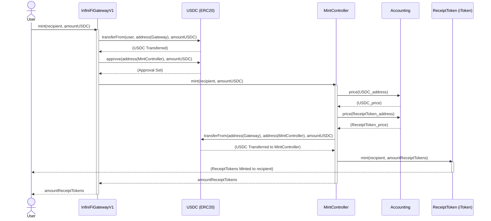
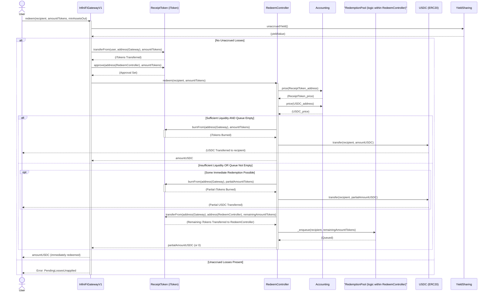
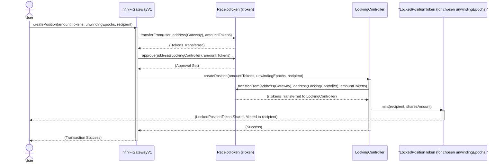
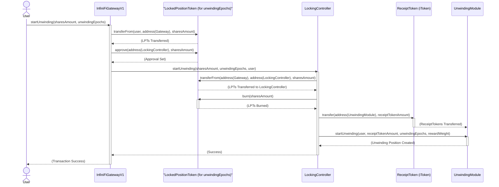
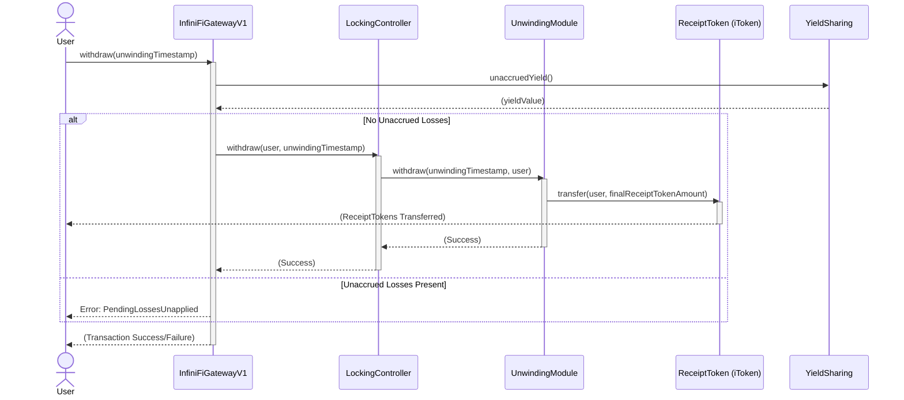
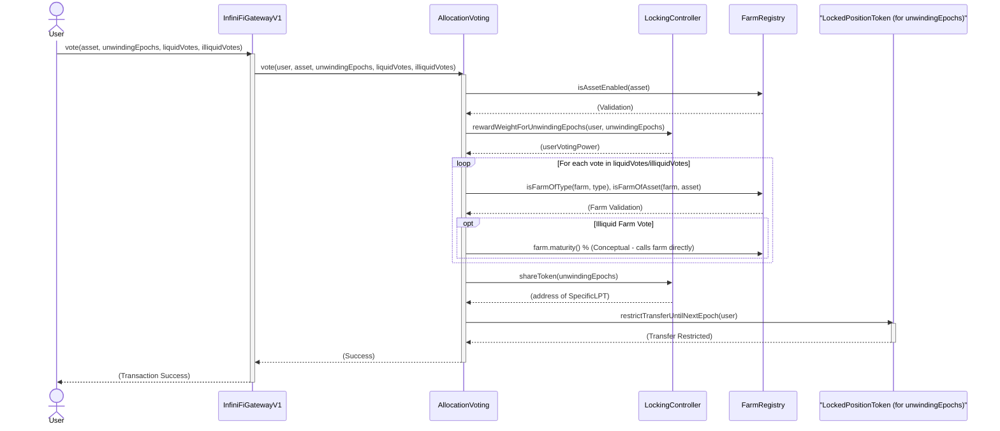

# InfiniFi Protocol: Typical User Flows Analysis

This document outlines common user interaction flows within the InfiniFi protocol, detailing the sequence of contract calls and key operations. The `InfiniFiGatewayV1` is the primary entry point for users, orchestrating calls to various backend controllers and modules.

## 1. Minting Receipt Tokens (iTokens)

This flow describes a user depositing a base asset (e.g., USDC) to receive protocol Receipt Tokens (iTokens, e.g., iUSD).

**Textual Description:**

1.  **User to Gateway:** The user initiates a minting request by calling `InfiniFiGatewayV1.mint(recipientAddress, amount)`. They must have pre-approved the Gateway to spend their USDC, or the Gateway's `mint` function must handle the `transferFrom` for the USDC.
2.  **Gateway Transfers Collateral:** `InfiniFiGatewayV1` transfers `amount` of USDC from the user (or itself if already transferred) to its own address.
3.  **Gateway Approves MintController:** `InfiniFiGatewayV1` approves the `MintController` (address obtained from its registry via `getAddress("mintController")`) to spend the received USDC.
4.  **Gateway Calls MintController:** `InfiniFiGatewayV1` calls `MintController.mint(recipientAddress, amount)`.
    *   `MintController` calculates the amount of Receipt Tokens to mint using `assetToReceipt()`, which involves fetching prices for the asset (USDC) and the Receipt Token from the `Accounting` contract.
    *   `MintController` transfers the USDC from `InfiniFiGatewayV1` to itself.
    *   `MintController` calls `ReceiptToken.mint(recipientAddress, receiptTokenAmount)` (MintController has `RECEIPT_TOKEN_MINTER` role).
5.  **Tokens Minted:** `ReceiptToken` mints the new iTokens directly to the `recipientAddress`.
6.  **Gateway Returns:** The `InfiniFiGatewayV1.mint()` function returns the amount of iTokens minted.

**Mermaid Sequence Diagram:**

## 2. Redeeming Receipt Tokens (iTokens)

This flow describes a user burning their iTokens to withdraw the underlying collateral (e.g., USDC). It considers both immediate redemption and queued redemption if liquidity is insufficient.

**Textual Description:**

1.  **User to Gateway:** The user initiates a redemption request by calling `InfiniFiGatewayV1.redeem(recipientAddress, amountITokens, minAssetsOut)`. The user must have pre-approved the Gateway to spend their iTokens.
2.  **Gateway Checks Losses:** `InfiniFiGatewayV1` calls `_revertIfThereAreUnaccruedLosses()`, which queries `YieldSharing.unaccruedYield()`. If there are losses, the transaction reverts.
3.  **Gateway Transfers iTokens:** `InfiniFiGatewayV1` transfers `amountITokens` of `ReceiptToken` from the user to its own address.
4.  **Gateway Approves RedeemController:** `InfiniFiGatewayV1` approves the `RedeemController` (address from `getAddress("redeemController")`) to spend these iTokens.
5.  **Gateway Calls RedeemController:** `InfiniFiGatewayV1` calls `RedeemController.redeem(recipientAddress, amountITokens)`.
    *   `RedeemController` calculates the expected `assetAmountOut` (USDC) using `_getReceiptToAssetConvertRatio()` (which involves `Accounting`).
    *   **Scenario A: Queue Active or Insufficient Liquidity for Full Redemption:**
        *   If `RedeemController.queueLength() > 0` or if `assetAmountOut > RedeemController.liquidity()`:
            *   If some liquidity is available but not enough for the full amount, that portion is processed immediately: `ReceiptToken.burnFrom(address(Gateway), portionToBurn)` is called, and the corresponding USDC is transferred to `recipientAddress`.
            *   The remaining (or full, if queue was active or zero initial liquidity) `amountITokens` (or portion thereof) are transferred from `InfiniFiGatewayV1` to `RedeemController`.
            *   `RedeemController` calls `_enqueue(recipientAddress, remainingReceiptToQueue)` (from `RedemptionPool` logic) to add the request to the redemption queue.
            *   The function returns the amount of USDC immediately redeemed (could be 0).
    *   **Scenario B: Sufficient Liquidity for Immediate Full Redemption:**
        *   `RedeemController` calls `ReceiptToken.burnFrom(address(Gateway), amountITokens)` (RedeemController has `RECEIPT_TOKEN_BURNER` role).
        *   `RedeemController` transfers `assetAmountOut` of USDC to `recipientAddress`.
        *   The function returns `assetAmountOut`.
6.  **Gateway Returns:** `InfiniFiGatewayV1.redeem()` returns the amount of USDC actually withdrawn. The user might need to call `claimRedemption()` later if their request was fully or partially queued.

**Mermaid Sequence Diagram:**

## 3. Locking Receipt Tokens

This flow describes a user locking their iTokens to receive `LockedPositionToken`s for a specific duration, aiming for enhanced yield.

**Textual Description:**

1.  **User to Gateway:** The user initiates a locking request by calling `InfiniFiGatewayV1.createPosition(amountITokens, unwindingEpochs, recipientAddress)`. The user must have pre-approved the Gateway to spend their iTokens.
2.  **Gateway Transfers iTokens:** `InfiniFiGatewayV1` transfers `amountITokens` of `ReceiptToken` from the user to its own address.
3.  **Gateway Approves LockingController:** `InfiniFiGatewayV1` approves the `LockingController` (address from `getAddress("lockingController")`) to spend these iTokens.
4.  **Gateway Calls LockingController:** `InfiniFiGatewayV1` calls `LockingController.createPosition(amountITokens, unwindingEpochs, recipientAddress)`.
    *   `LockingController` verifies `unwindingEpochs` corresponds to an enabled bucket.
    *   `LockingController` transfers `amountITokens` from `InfiniFiGatewayV1` to itself.
    *   It calculates the amount of specific `LockedPositionToken` shares to mint based on the current state of the chosen bucket (total iTokens in bucket vs. total shares of that `LockedPositionToken`).
    *   `LockingController` calls `mint(recipientAddress, sharesAmount)` on the specific `LockedPositionToken` contract for the chosen `unwindingEpochs` bucket (LockingController has `LOCKED_TOKEN_MANAGER` role).
5.  **Shares Minted:** The specific `LockedPositionToken` mints shares to the `recipientAddress`.
6.  **State Update:** `LockingController` updates its internal accounting for the bucket (total iTokens, global reward weight).
7.  **Gateway Interaction (No direct return value for this specific flow shown in `InfiniFiGatewayV1.sol`, but the transaction succeeds/fails):** The user now holds `LockedPositionToken`s.

**Mermaid Sequence Diagram:**

## 4. Starting Unwinding for a Locked Position

This flow describes a user initiating the unwinding process for their locked position. They will burn their `LockedPositionToken`s and their underlying iTokens will be moved to the `UnwindingModule`.

**Textual Description:**

1.  **User to Gateway:** The user initiates an unwinding request by calling `InfiniFiGatewayV1.startUnwinding(sharesAmount, unwindingEpochs)`. The user (msg.sender to Gateway) is the recipient of the unwinding position. User must have approved Gateway for their `LockedPositionToken`s.
2.  **Gateway Transfers LPT:** `InfiniFiGatewayV1` transfers `sharesAmount` of the specific `LockedPositionToken` (for `unwindingEpochs`) from the user to its own address.
3.  **Gateway Approves LockingController:** `InfiniFiGatewayV1` approves `LockingController` to spend these `LockedPositionToken`s.
4.  **Gateway Calls LockingController:** `InfiniFiGatewayV1` calls `LockingController.startUnwinding(sharesAmount, unwindingEpochs, userAddress)`.
    *   `LockingController` verifies the bucket for `unwindingEpochs`.
    *   `LockingController` transfers `sharesAmount` of `LockedPositionToken` from `InfiniFiGatewayV1` to itself.
    *   `LockingController` calls `burn(sharesAmount)` on the specific `LockedPositionToken` contract.
    *   It calculates the corresponding amount of `ReceiptToken` based on the shares being burned and the bucket's current state.
    *   `LockingController` transfers this `ReceiptToken` amount to the `UnwindingModule` contract (address stored in `LockingController`).
    *   `LockingController` calls `UnwindingModule.startUnwinding(userAddress, receiptTokenAmount, unwindingEpochs, rewardWeight)`.
5.  **Unwinding Position Created:** `UnwindingModule` creates an internal record for the user's unwinding position, including start/end epochs and reward parameters.
6.  **State Update:** `LockingController` updates its internal accounting (reduces iTokens in the bucket, adjusts global reward weight).
7.  **Gateway Interaction:** The transaction completes. The user's iTokens are now in the `UnwindingModule`.

**Mermaid Sequence Diagram:**

## 5. Withdrawing Unwound Tokens

This flow describes a user claiming their iTokens (which become liquid collateral) after the unwinding period for their locked position has successfully completed.

**Textual Description:**

1.  **User to Gateway:** The user initiates a withdrawal by calling `InfiniFiGatewayV1.withdraw(unwindingTimestamp)`. `unwindingTimestamp` is the timestamp when their unwinding process started, used as an ID in `UnwindingModule`.
2.  **Gateway Checks Losses:** `InfiniFiGatewayV1` calls `_revertIfThereAreUnaccruedLosses()` (queries `YieldSharing`).
3.  **Gateway Calls LockingController:** `InfiniFiGatewayV1` calls `LockingController.withdraw(userAddress, unwindingTimestamp)`. (Note: `userAddress` is `msg.sender` from Gateway's perspective).
    *   `LockingController` relays this call to `UnwindingModule.withdraw(unwindingTimestamp, userAddress)`.
4.  **UnwindingModule Processes Withdrawal:**
    *   `UnwindingModule` verifies that the current time is past the position's `toEpoch`.
    *   It calculates the final amount of `ReceiptToken` due to the user, including any rewards accrued or losses applied during the unwinding period.
    *   It deletes the user's unwinding position from its state.
    *   It transfers the final `ReceiptToken` amount directly to the `userAddress`.
5.  **Gateway Interaction:** The `ReceiptToken`s are transferred to the user.

**Mermaid Sequence Diagram:**

## 6. Voting for Farm Allocation

This flow describes a user with a locked position (and thus `LockedPositionToken`s) voting on how protocol assets should be allocated across different farms.

**Textual Description:**

1.  **User to Gateway:** The user constructs their vote (arrays of `AllocationVote` structs for liquid and illiquid farms) and calls `InfiniFiGatewayV1.vote(asset, unwindingEpochs, liquidVotes, illiquidVotes)`. `asset` is the underlying asset for the farms being voted on, `unwindingEpochs` specifies which of the user's locked positions is being used for voting power.
2.  **Gateway Calls AllocationVoting:** `InfiniFiGatewayV1` calls `AllocationVoting.vote(userAddress, asset, unwindingEpochs, liquidVotes, illiquidVotes)`. (Note: `userAddress` is `msg.sender` from Gateway's perspective).
    *   `AllocationVoting` validates the `asset` with `FarmRegistry`.
    *   It checks `lastVoteEpoch` to prevent double voting in the same epoch for the same locked position.
    *   It queries `LockingController.rewardWeightForUnwindingEpochs(userAddress, unwindingEpochs)` to get the user's voting power.
    *   It calls `_storeUserVotes` internally:
        *   This function iterates through the provided votes. For each vote, it validates the farm with `FarmRegistry` (correct asset and type). For illiquid farms, it further validates farm maturity against the user's lock duration.
        *   It updates `farmWeightData[farm].nextWeight` for each voted farm, adding the user's weighted vote. If it's the first vote for a farm in a new epoch, previous `nextWeight` is rolled into `currentWeight`.
    *   `AllocationVoting` fetches the user's specific `LockedPositionToken` address from `LockingController.shareToken(unwindingEpochs)`.
    *   It then calls `restrictTransferUntilNextEpoch(userAddress)` on that `LockedPositionToken` contract.
3.  **Vote Recorded & Transfer Restricted:** The user's vote is recorded in `AllocationVoting`, and their ability to transfer that specific `LockedPositionToken` is paused until the next epoch.
4.  **Gateway Interaction:** The transaction completes.

**Mermaid Sequence Diagram:**

